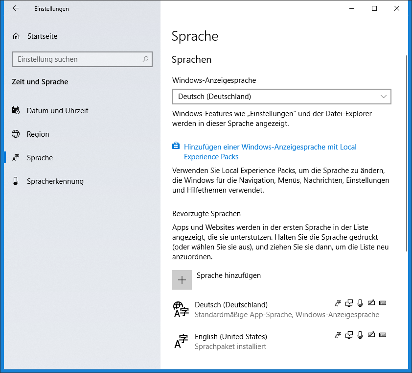

# Rechtschreibung

Ich benutze als Editor für Markdown VS Code mit spellright, und das wird automatisch in `.vscode/settings.json` vermerkt.
```
{
    "spellright.language": [
        "de",
        "en"
    ],
    "spellright.documentTypes": [
        "markdown",
        "latex",
        "plaintext"
    ]
}
```

Richtig ist, was **spell right** happy macht!
Mehr gibt es dazu eigentlich nicht zu sagen, end of story, soweit zum Code of Conduct.

Wenn ich `spell right` schreibe ist alles gut. Wenn ich `spellright` zusammenschreibe als ein Wort, dann ist es zunächst ein Problem.

Inhalt von `spellright.dict`:
```
mitloggen
auskommentiert
voreingestellte
vorkonfigurierten
gezeiteten
Gezeitet
voreingestellten
xap
zurückzuliefernde
Statefull
zurückzuliefernden
docroot
rdg
vorkonfiguriert
Sommmersonnen
bilder
Clienten
zurückgepostet
Bojenrundungen
rd
neustart
gsmxp
Araxis
fria
freo
spellright.dict
spellright
```
Den letzten Eintrag im `workspace dictionary` gesehen? Problem gelöst, fast.

Damit `spellright` funktioniert mit beiden Sprachen ist es wichtig, 
dass auch **English** installiert ist.

Beispiel Windows 10: Tastatur-Layout immer noch Deutsch, aber zwei Sprachen sind installiert.



> Immer richtig: Wie ich es in der Schule gelernt habe!

Da von Client Sockets in der Schule keine Rede war existiert hier ein Raum von Freiheit,
der International ist.

[Top](#){: .start-btn }
[Zurück zum Test](test.html){: .start-btn}