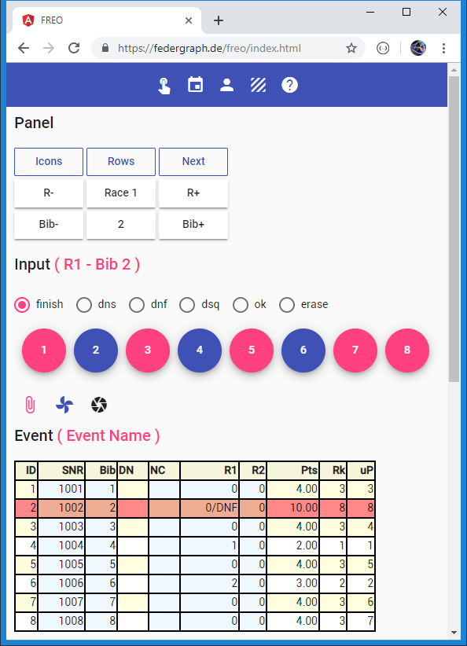

# Fleetrace Event Only App

*Screenshot von Freo.*<br>


Die letzte Aktion im Bild oben war gewesen, dass **Bib 2** angetippt wurde, als `dnf` ausgewählt war.
Die Radio-Button Auswahl springt automatisch auf den Standardwert `finish` zurück.
Zuvor wurde bereits der Zieldurchgang von Bib 4 und Bib 6 erfasst.
Wir befinden uns im Race 1, also in Wettfahrt 1 (**R1**).
Bib 2 (Bugnummer 2) ist jetzt aktuell, weil sie zuletzt benutzt wurde.

## Externer Link

[Start von FREO](https://federgraph.de/freo/index.html){: .start-btn }

## About FREO

Eine Angular / Typescript Applikation für FR.

Bei FREO handelt es sich um die **Event Only** Version.

Sie können Zeitnahme-Daten einloggen (Zielpositionen und Penalties).
Der aktuelle Stand wird in der Anwendung selbst berechnen.

## Kurzanleitung

Kopiert von `federgraph.de`, ich darf das, es ist jetzt die dritte Kopie, eine befindet sich in der App selbst.

> Dieser Hilfe-Text ist eventuell aktueller als der Hilfe-Text in der App.

Ich empfehle, dass Sie folgendes probieren, es sollte funktionieren:

1. Klicken Sie als erstes auf Reset, damit wird der fest eingebaute Test-Event geladen und die Event-Tabelle angezeigt.
1. Der Test-Event hat zwei Wettfahrten (races).
1. Navigieren Sie mit Klick auf R- und R+ zu den Wettfahrten.
1. Mit Klick auf Next gelangen Sie wieder zu Wettfahrt 1 (R1). 
1. Das funktioniert, weil Button Next ermittelt wo Sie sich im Ablauf befinden - im ersten Rennen.
1. Beachten Sie, dass die aktuelle Wettfahrt als Teil der Überschrift Input angezeigt wird.    
1. Klicken Sie auf die runden fab Flächen (fab = floating action button).
1. Mindestens einmal probieren: den dnf radio Button auswählen bevor Sie klicken.
1. Achten Sie darauf, wie nach Klick auf fab die Radio-Auswahl auf finish zurückgestellt wird.
1. Alle fabs sind in der richtigen Reihenfolge zu drücken.
1. Wenn alle blau sind - Next drücken.
1. Sie finden sich dann im nächsten Rennen wieder, und die fabs sind wieder da.    
1. Weiter wie im ersten Rennen, es wiederholt sich.
1. Probieren Sie alle Icons aus, die meisten sind vom Reduce-To Typ.
1. Einige der Icons schalten um (toggle), zeigen an (show), verbergen (hide), oder reduzieren auf die entsprechende Ansicht (reduce to).
1. Stellen Sie die Eingabe der Zielpositionen in Wettfahrt 2 fertig.
1. Der Test-Event hat nur zwei Wettfahrten.
1. Überprüfen Sie die Ergebnisberechnung in der Event-Tabelle.
1. Verändern Sie die Anzahl der Streicher mit T+ und T- (throwouts).
1. Sortieren Sie die Tabelle mit Klick auf Spaltenkopf.
1. Finden Sie den Pre-Text Bereich und kopieren Sie den Ergebnis-Text im kompakten Format in die Zwischenablage.
1. Fügen Sie den Text probeweise in Ihren bevorzugten Text-Editor ein. (Visual Studio Code).
1. Ich gehe davon aus dass Sie in Chrome auf dem Desktop testen, danach auf dem Tablet und zum Schluss auf dem Telefon.

Sie müssen für alle Teilnehmer pro Wettfahrt eine Zielposition oder einen Statuswert eingeben.

- Eine Regatta hat Events.
- Ein Event wird auch als Division bezeichnet (siehe division params, DP).
- Ein Event hat Races und Entries, Spalten und Zeilen, Wettfahrten und Teilnehmer.
- Die Entries im Race sind die Bibs (Startnummern), korrespondierend mit Bug-Nummern.
- Durch antippen der Schaltflächen (tapping on fabs) machen Sie alle einzeln fertig!
- Anstelle der Position kann ein Status zugewiesen werden, zum Beispiel dnf.
- Genauso kann eine Position (mit erase) oder ein Status (mit ok) auch gelöscht werden.

Ein gewisses Maß an Magie ist am Werk, verkörpert durch den Eingabe-Modus (input mode IM).

- Wenn Sie auf einen fab klicken - dann wird eine Nachricht (message) generiert mit einer Position die größer ist als die Anzahl der Teilnehmer.
- Im Eingabemodus Strikt wird das Programm automatisch den fortlaufenden Strom der Positionen aufrechterhalten.
- Sie müssen sich keine Gedanken um die tatsächlichen Zielpositionen machen.
- Dem Boot wird der nächste freie Platz zugewiesen.
- Sie klicken einfach auf die Bib (fab), der Rest ist automatisch.
- Merke: Wenn ein Event geladen wird erfolgt dies im Eingabemodus Relaxed unter Verwendung der tatsächlichen Zielpositionen.

Auf dem Desktop mit nur acht Booten in der Wettfahrt sollte alles mit Klick-Geschwindigkeit funktionieren.

- Sie können die Veränderung der Tabelle beobachten während Sie die Bibs nacheinander anklicken.
- Es ist normalerweise kein Problem nach jeder Eingabe alles neu zu berechnen und die Tabellen zu beobachten.
- Aber auf dem Telefon kann man keine große Tabelle anzeigen.
- Kleine Geräte können auch überfordert sein, wenn alles immer sofort ausgerechnet wird.
- Je größer die Anzahl der Teilnehmer desto langsamer wird es.
- Daher sollten Sie dort die Nachrichten-Schlange (message queue) benutzen.
- Die Verwendung der Queue wird mit dem Büroklammer-Icon gesteuert.
- Wenn die Queue aktiv ist sehen Sie zwei zusätzliche Icons.
- Bei Verwendung der Queue müssen Sie die Verarbeitung der Nachrichten (message processing) von Hand anstoßen.
- Klicken Sie dazu auf das Icon mit der flachliegenden Büroklammer, welches die Anzahl der in der Queue befindlichen Nachrichten anzeigt.
- Es ist möglich die Queue zu leeren ohne zu verarbeiten, bzw. den Inhalt der Queue im Pre-Text anzuzeigen.

Verändern Sie die Daten, korrigieren Sie den Wert für eine Bib in einem Race

- Kontrollieren / wählen Sie am besten zuerst die Bib.
- Die Bib vom zuletzt weggeklickten fab wird zur aktuellen Bib, ist also in der Regel schon ausgewählt.    
- Mit Bib- und Bib+ können Sie jede verwendete Bib auswählen.
- Achten Sie auf die radios, in der Regel müssen Sie erase oder ok auswählen.
- Dann kommt das blaue Spielzeug (toy Icon) zum Zug.
- Beachten Sie, dass auf diese Weise eine Was-Wäre-Wenn Analyse in den heruntergeladenen Event-Daten erfolgen kann.
- Zum Beispiel: Was-Wäre-Wenn ich nicht disqualifiziert worden wäre.

Und wenn es nun Probleme, Fehleingaben oder spezielle Situationen gibt?

- Wie kann zum Beispiel eine Prozentstrafe eingegeben werden oder ein dpi-Penalty?
- Wie kann nachträglich eine Zielposition korrigiert werden?
- Sie können den Event-Text editieren und erneut einlesen.
- Benutzen Sie dazu das html text area Eingabeelement.
- Lernen Sie von den Beispielen.
- Die Beispiele zeigen wie die Nachrichten kodiert sind.
- Um eine Zielposition zu korrigieren fügen Sie eine RV-Nachricht (RaceValue message) mit der tatsächlichen Position hinzu,
  nachdem Eingabemodus Strikt aktiviert wurde.
- Nach dem Editieren des Textes klicken Sie auf das Icon, mit dem gelesen wird.
- (In der Desktop-Applikation würden Sie einfach in die entsprechende Zelle des Grids gehen und die neue Zahl eingeben.)

```
//im text area input element ...
//... event data, geladen mit EP.IM = Relaxed (Input Mode Relaxed)
//... relaxed input mode ist implizit beim Lesen

EP.IM = Strict
FR.*.W2.Bib2.RV=4
```

Warum nicht einfach die Zielpositionen vom schwarzen Brett entnehmen?

- Das ist ein prima Anwendungsfall.
- Sie bilden ein Zwei-Personen-Team.
- Einer liest die Positionen vor.
- Der Andere tippt.
- Vor dem ersten Rennen: Neuen Event erzeugen mit der entsprechenden Anzahl von Teilnehmern und Wettfahrten.
- Vergessen Sie nicht im Local Storage zu speichern (Save). 
  Der *Lokale Speicher* wird vom Browser verwaltet und kann mit den Browser-Werkzeugen eingesehen und gelöscht werden.
- Am nächsten Tag müssen Sie laden (Load) bevor Sie weitermachen.

Wir machen es uns einfach mit den Namen der Teilnehmer in dieser Version der App.

- Wenn die Wettfahrten laufen ist die Teilnehmerregistrierung beendet.
- Entry info sollte fertig vorbereitet in die Event-Daten eingefügt sein, die Sie laden.
- Beim Race-Timing kümmern wir uns nicht um die Namen.
- Meine Test-Daten enthalten sowieso keine Namen.
- Die Tabelle der Entries wird also meistens leer sein.
- In den *light* Versionen habe ich die Stammdatentabelle komplett herausgenommen.

Beginnen Sie mit dem Aufzeichnen der Zielpositionen.

- Hoffentlich hat das "Komitee" die Bugnummern bei 1 beginnend lückenlos vergeben.
- Um das Datenformat kennenzulernen studieren Sie das normale und das kompakte Format in Pre-Text.
- Pre-Text und Text-Area kann mit einem Icon Button eingeblendet werden.
- Testen Sie auf dem Desktop, wo Sie eine gute Tastatur haben und komfortable mit der Zwischenablage arbeiten können.

## Aktuelle Version

Die aktuelle Version befindet sich auf GitHub, see repository **FR03E1**.

FREO, wie im Link oben und FR03E1 auf GitHub sind nicht exakt identisch, aber fast.

FR03E1 soll von der Delphi Applikation oder von Node.js oder von ASP.Net ausgeliefert werden,
also von einem Server, der eine Api implementiert, und wo Daten auch hochgeladen werden können.

FREO kann das nicht, FREO kann Daten im Local Storage im Browser speichern, gerade so,
ich weiß nicht ob Sie das verwenden werden, ob das praktikabel ist.

```
Local Storage Key = 'fr-event-data'
```

[Nach oben](#)
