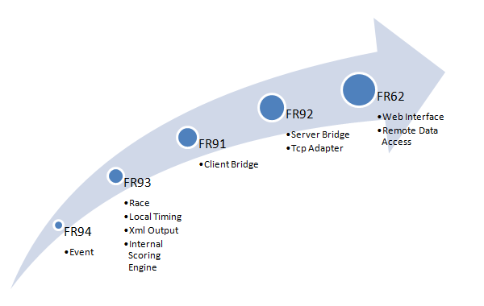
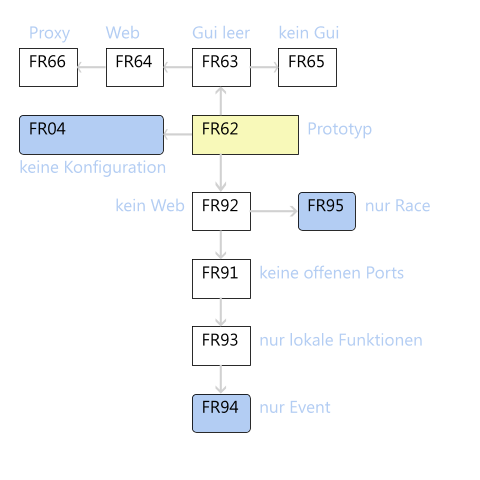
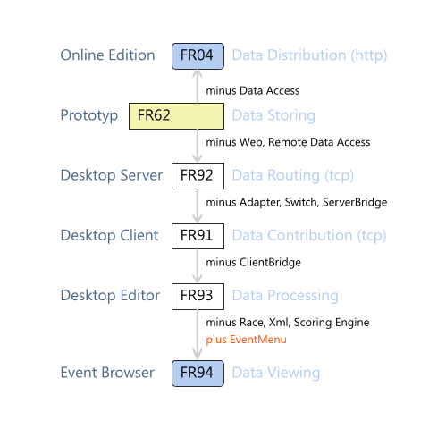



# FR (Fleetrace)

## Allgemeine Grundsätze

FR wurde als vielseitig verwendbares, netzwerkfähiges Programm geplant. 
Protokolle und Schnittstellen wurden in eigener Regie spezifiziert mit der 
Maßgabe, dass der unverschlüsselte Telegrammverkehr ohne Bedienungsanleitung 
verständlich sein soll.

Die wichtigsten Merkmale der Anwendung FR sind:

- An allen Endpunkten (downstream) wird gerechnet (compute everywhere). Da jeder 
rechnet, können Daten verändert werden (what-if-analysis). Die Änderungen durch 
den Benutzer können privat oder für alle sichtbar sein (aufwendiger).

- Nur die Messdaten werden gespeichert und übertragen, nicht die berechneten 
Ergebnisse.

- Alle Daten liegen als lesbarer Text vor, es werden keine binär kodierten Daten verwendet.

- Das verwendete Protokoll wird selbst definiert. (Stichwort: domain specific language)

- Durch Unabhängigkeit von Drittpartei-Komponenten wird die Portierbarkeit erleichtert.

- Durch Implementierung des Systems auf mehreren Plattformen können optimale Kombinationen bereitgestellt werden.
Zum Beispiel: Ajax-Timing-Client, Delphi-Result-Server, Angular-Result-Client, Java-Result-Client.

- Die einzelnen Knotenpunkte können flexibel vernetzt werden.

- Prinzipiell kann jeder Knoten auch als Datenquelle dienen.

- Alles läuft transparent und gleichberechtigt ab.
Jeder Knoten erhält die vollständigen Eingangsdaten.
Jeder Knoten hat Zugriff auf die Berechnung.

Das Prinzip *Compute Everywhere* steht im Gegensatz zur Grundregel, nach der nur 
einer rechnen darf und alle anderen nur einen Bericht erhalten. Wenn nun 
jeder rechnet und das gleiche Programm einmal in C# und zum anderen in Java 
programmiert wird, dann kann es theoretisch und praktisch vorkommen, dass die 
Ergebnisse nicht exakt übereinstimmen. Wir nutzten diese 
Konkurrenzsituation konstruktiv für die interne Qualitätssicherung!

Der im Projekt enthaltene Mechanismus zur automatischen Datenweiterleitung 
entspricht einem Chat Server bzw. einer Message Oriented Middleware (MOM). Die 
Funktionalität wird nur mit den üblichen Socket Komponenten realisiert und ist 
Bestanteil des *Frameworks*. Der Anwender benötigt keine Anmeldung bei Jabber.

## Konkrete Projekte

### Entwicklungslinien

FR ist eigentlich eine Programmfamilie. Auf jeder Entwicklungsplattform gibt 
es verschiedene Ziele.

Ausgehend vom Prototyp FR62 sind vier Entwicklungslinien zu unterscheiden:
- Die Server Linie mit FR63 als Startpunkt (ohne GUI).
- Die Online Linie mit FR04 als Startpunkt (ohne Konfiguration und ohne Datenzugriff).
- Die Editor Linie mit FR92 als Startpunkt (ohne Webinterface).
- Die Feature Line mit FR38 und FR98 als Beispiel.

### Server Linie

Die Server Linie entfernt das GUI, so dass das Programm als Server eingesetzt 
werden kann. Sowohl das Web Interface, als auch der Datenzugriff bleiben zunächst 
erhalten.

- FR63: Desktopanwendung mit leerer Oberfläche
- FR64: Web Anwendung (rechnend)
- FR65: (Windows) Service.
- FR66: Web Anwendung (proxy)

### Online Linie

Die Online Linie entfernt den Datenzugriff inklusive der dateibasierten 
Konfiguration und betont das Web Interface. Das Programm wird auf einer im Netz 
sichtbaren Maschine gestartet und läuft ohne Bedienung, solange die 
Serverfunktion gebraucht wird. Die Einstellung kann aus der Ferne erfolgen.

- FR04: Desktop Edition.
- FR05: Home Server Edition
- FR06: EC2 Edition

### Editor Linie

Die Editor Linie entfernt das Web Interface und danach schrittweise die 
übrigen Netzwerkfunktionen, so dass ein einfaches lokal agierendes Programm 
übrigbleibt, mit dem Daten editiert werden können, die von der Festplatte 
gelesen werden.

- FR92: Programmversion ohne Webinterface
- FR95: Race Data Manager
- FR91: Bridge Client Edition
- FR93: Lokaler Editor
- FR94: Event Data Viewer

### Feature Linie

Die Feature Linie zieht jeweils ein einzelnes Feature aus der 
Prototyp Anwendung heraus. Nachrichten die von der internen Version über eine 
interne Verbindung gesendet wurden, werden jetzt vom eigenständigen Programm 
über das Netzwerk geschickt.

- FR38: Timing Client (Timing Tab als eigenständiges Programm).
- FR90: Pocket Timer Adapter.
- FR98: Output Client (Browser Tab, Report Tab als eigenständiges Programm, Programm wird über tcp mit Notifikationen versorgt.)
- FRXX: Externe Server Bridge
- FRXX: Scoring Modul
- FRXX: Scoring Server
- FRXX: Switch Server
- FRXX: Switch Clienten

Die Vertreter dieser Linie haben in der Regel nur eine geringe Schnittmenge 
mit der Prototyp Anwendung. Dafür ist die potentielle Variantenvielfalt hier 
besonders groß.

