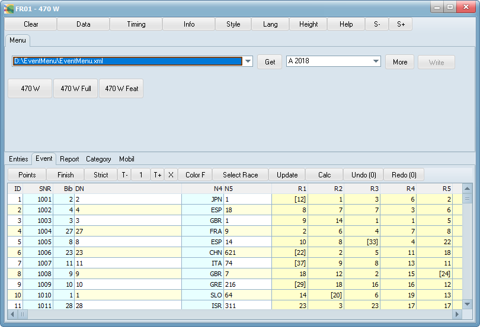



# FR01

## Update 2019

Der Quelltext von FR01 kann jetzt von GitHub geladen werden.
Kompilieren Sie die Anwendung von der aktuellen Quelle.

## Update 2012

FR01 steht auf www.fleetrace.org zum Download bereit.
Weitere Informationen werden dort im Blog gepostet.

Vom Internet aus können Daten des laufenden Events geladen und lokal verändert werden.

Beispiel: Unmittelbar nach Schluss der dritten Wettfahrt laden 
Sie sich den aktuellen Stand von Wettfahrt 2 herunter. Den 
Zieldurchgang der aktuellen Wettfahrt können Sie schnell eingeben. 
Es dauert weniger als eine Minute, wenn Sie die Operation mit Papier 
und Bleistift vorbereitet haben. Das Programm rechnet und sortiert. 
Sie können Penalties löschen oder hinzufügen, die Anzahl der 
Streicher oder Zielpositionen ändern.

Ihre Ergänzungen können zurück gepostet werden, wenn diese Möglichkeit eingerichtet wurde.
