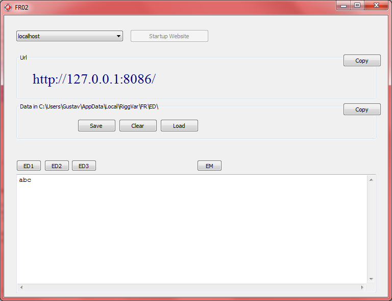



<h1>FR02</h1>



```
ED1 = Event Data 1 im Memo anzeigen
ED2 = Event Data 2 im Memo anzeigen
ED3 = Event Data 3 im Memo anzeigen

EM = Event Menu im Memo anzeigen
```

Also, es gibt hier offensichtlich 3 Slots, für 3 separate Events, genau drei.
Ein **Slot** ist ein `String` im Hauptspeicher, eine *Variable*.

Dem entsprechend gibt es auf der Festplatte drei Dateien mit fixem Namen, nach Konvention.

```
Combobox = Wähle das Netzwerk Interface an dem der Http Socket geöffnet werden soll.
Startup Website = Öffnet den Port.

Save = Speichere Inhalte der Variablen ED1 in Datei.
clear = Initialisiere alle 3 Slots mit default event data.
Load = Lade alle 3 Slots von der Festplatte
```

Ich sehe dieses Bild und ich glaube so ist es. Ich könnte natürlich nachsehen, ob es wirklich so ist,
aber ich bin gerade beim Schreiben und meine Aufgabe ist es, die Doku für GitHub Pages vorzubereiten.
Da ist es nicht erforderlich, dass alles stimmt. Es kann später korrigiert und angepasst werden.
Sie können sowieso nichts glauben, was in der Dokumentation steht. Die Wahrheit ist in der Quelle, immer.

FR02 ist einfach zu benutzen, sie müssen keine Dateinamen ausdenken.
Über das Memo können Sie jederzeit die Daten in die Zwischenablage kopieren, in Notepad einfügen,
unter dem gewünschten Namen speichern, und hochladen - 
falls mit dem angeschlossene Clienten tatsächlich erhaltenswerte Daten eingegeben wurden.

Zum Testen gut geeignet. Ich will dieses Programm nicht klein reden. 
Eventuell ist es genau das was Sie brauchen.

## Update 2019

So etwas wie FR02 wird es geben. Etwas, was in etwa den gleichen Funktionsumfang realisiert.
Dieses etwas könnte dann FR02 heißen, damit man weiß worum es sich handelt.
Es sollte die Api implementieren, wenigstens teilweise.
Teile der Api von heute gehen auf FR02 zurück, mit anderen Worten, FR02 wird immer noch unterstützt.

## Update 2012

Damit FR01 Daten über http downloaden kann, wird mit FR02 eine Minimalvariante der Website bereitgestellt.

Der Server für die Daten des Events kann je nach Bedarf mit unterschiedlichen Technologien 
an verschiedenen Orten in verschiedenen Ausführungen realisiert werden. 
Von statischen Daten auf der lokalen Maschine bis zum Container in der Cloud ist alles möglich.

FR02 ist gut geeignet für den Anfang, das Programm ist extrem einfach zu benutzen, 
und außerdem im Prinzip völlig ausreichend für den Betrieb vor Ort.
