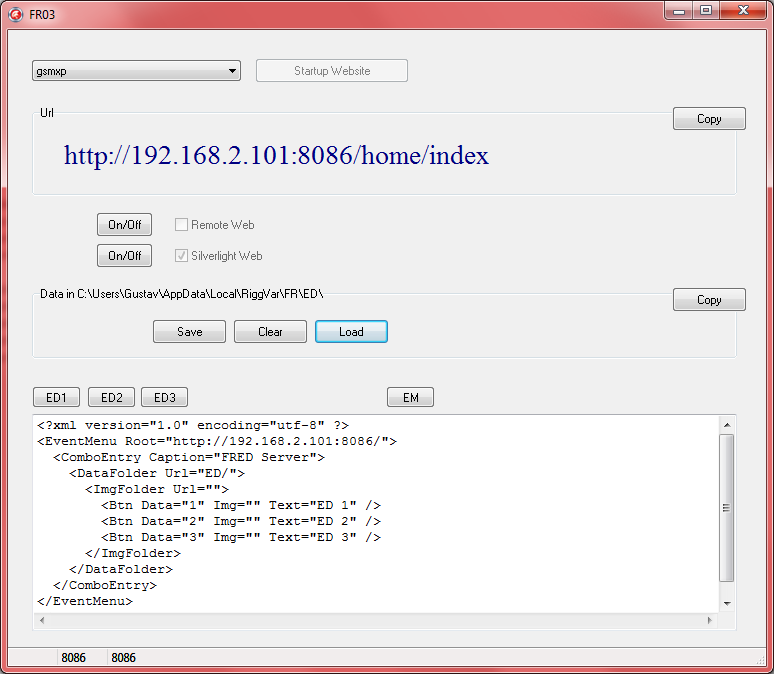



# FR03

Hier im Bild zu sehen ist `gsmxp` anstelle von `localhost`. 
Gsmxp wäre der Name der lokalen Maschine (hostname).
Ich nehme stark an, dass dieser Name automatisch ermittelt wird,
Sie sollten also dort den Namen Ihres Rechners sehen.

Im Gegensatz zu FR02 wird hier etwas mehr als nur eine minimale Api implementiert.
Sie können also zu /home/index browsen, dem Home Web, welches immer vorhanden ist.

Remote Web und Silverlight Web können optional aktiviert werden.
Im Modus Off wird jeder Traffic abgewiesen, nicht ausgewertet, es kommt dann nur eine Standard Antwort zurück.
Wenn umgeschaltet wird zwischen On/Off, dann wird nicht immer der Socket geöffnet/geschlossen,
der Socket wird nur einmal geöffnet und bleibt offen.
Es wird quasi nur ein interner Schalter umgelegt, und Verkehr zugelassen oder nicht.

Es sind immer noch drei Events. Und im Memo ist das EventMenu.xml zu sehen, welches die Clienten laden,
um zu erfahren, dass es hier drei Events zu holen gibt, **ED 1** usw.
Man kann aus dem EventMenu.xml auch entnehmen wie die Url für ED1 lauten müsste:
`http://192.168.2.101:8086/ED1`, (Ihre IP Adresse wird eine andere sein).

Eine kompatible Lösung sollte also einen http Get Endpunkt `ED1` unterstützen, der einen String liefert,
aus Gründen der backward compatibility, damit die alten Clienten noch funktionieren.

Weiterhin aus dem Bild zu entnehmen ist, dass FR03 der **FRED Server** ist, gut zu wissen.

## Update 2019

Heute würde man den Angular Client ausliefern, anstelle des Silverlight Client.

Ich lasse den Text von 2012 am besten unverändert. 
Dort steht, dass von FR01 Html Fragmente hochgeladen werden.
Das war mir nicht mehr klar, aber es macht Sinn.
Im Prinzip ist das großartig, weil ich gerade über Html Fragmente geschrieben habe.
Es hätte ja auch Text oder Xml sein können, was von FR01 zu FR03 hochgeladen wird.
Man müsste es überprüfen.

Den Angular Client habe ich mit FR69 getestet und mit einem Node.js server, und mit einer Asp.Net Anwendung.
FR03 wurde noch nicht wieder fit gemacht, könnte aber noch passieren.
Zunächst gilt es die aktualisierte Api festzulegen.
FR03 gibt uns einen Hinweis, dass ED1 bis ED3 enthalten sein sollten.

Zum Beispiel weiß ich, dass es die Slots in FR69 gibt, und dass ich diese neu beleget habe,
EventData.json auf Slot 2 und RaceData.json auf Slot 3.
Die hochgeladenen Strings, es sind immer noch Strings, liegen dann einfach dort und können abgeholt werden,
vom Client oder von der Server Anwendung selbst.
Zum Beispiel kann FR69 die hochgeladenen Daten laden, also Json auswerten, das ist neu, das wurde ergänzt.

Die hochgeladenen Daten werden also nicht automatisch verarbeitet, müssen von Server überhaupt nicht ausgewertet  werden.
Es gibt als Teil der Api andere Endpunkte, welche die hochgeladenen Daten sofort verarbeiten, also versuchen, die Daten zu laden.

Die Slots sind dafür jedoch nicht gedacht. Wenn sich jemand fragt, wozu ED1 bis ED3 überhaupt existieren in FR69,
dann sollte er hierher kommen und lesen. FR03 ist ein Teil von FR69 oder umgekehrt.
Der Blick auf den Screenshot oben sollte die Sache klarstellen. Ich schreibe das hier alles gerade live.
Vielleicht hat es einen Nutzen. Auf zum nächsten Bild.

## Update 2012

FR03 ist eine Erweiterung von FR02.

Der Client, zum Beispiel FR01, kann Daten vom Server herunterladen,
verändern (ergänzen) und eventuell auch wieder zum Server hochladen.

Die vom Clienten (FR01) hochgeladenen Daten sind Html Fragmente,
die im Browser angezeigt werden können.
Der Server ergänzt nur den umgebenden Rahmen.

Im Gegensatz zu FR02, einer Minimalvariante des Servers, 
liefert FR03 einen Rahmen mit etwas mehr Stil, 
eine Sortiermöglichkeit und optional einen Silverlight Clienten.

Hier die Liste der Clienten:
- Browser ohne Javascript
- Browser mit Javascript
- Browser mit Silverlight (FRIA)
- FR01 als *Ersatz* für den Browser
  (besser, weil es eine Kopie der erzeugenden Anwendung selbst ist)

Einen *richtigen* Server, der nicht als Programm auf der lokalen Maschine läuft, 
sondern im Internet, kann man natürlich auch verwenden.
			