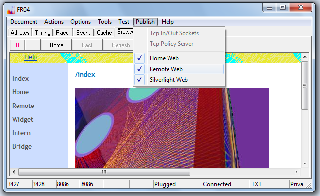
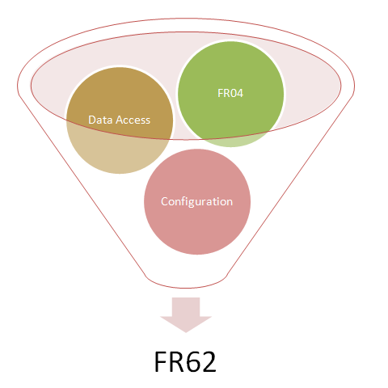



# FR04

## Basisvariante

**FR04** ist eine abgerüstete Variante von [FR62](FR62.html).
Diese Variante des Programms speichert nichts auf der Festplatte.
Es gibt auch keine Konfigurationsdatei.
Damit haben Sie bei jedem Start die gleiche Umgebung zur Verfügung.
FR04 ist in der Benutzung ähnlich unkompliziert wie der Silverlight Client.

FR04 kann Daten vom Web laden und verfügt über *collaboration features*.

## FR04 Feature Matrix

Die Programme FR04 **A** bis **I** unterscheiden sich nur durch die jeweils fest verdrahtete Konfiguration.

Variante **D** ist die als Server eingesetzte Variante.
Die fehlende Konfigurationsdatei ist hier kein Problem, da die IP-Adresse,
an der die Sockets geöffnet werden sollen,
dynamisch ermittelt werden kann.
Die Varianten **E** und **F** haben leichte Unterschiede zu **D** nur in Bezug auf die Einsatzumgebung.

Bei den Client Varianten **A**, **B**, **C** und **I** ergibt sich
durch die fehlende Konfigurationsdatei eine Einsatzbeschränkung auf die lokale Maschine.
Die letzten Anpassungen an konkrete Einsatzbedingungen werden nach Absprache mit dem Anwender vorgenommen.

<table>
    <thead>
        <tr>
            <th>Feature</th>
            <th>A</th>
            <th>B</th>
            <th>C</th>
            <th>D</th>
            <th>E</th>
            <th>F</th>
            <th>G</th>
            <th>H</th>
            <th>I</th>
        </tr>
    </thead>
    <tr>
        <td></td>
        <td>RO</td>
        <td>WO</td>
        <td>BC</td>
        <td>BS</td>
        <td>HS</td>
        <td>EC2</td>
        <td>Auswahl</td>
        <td>WS</td>
        <td>OB</td>
    </tr>
    <tr>
        <td>UI</td>
        <td>x</td>
        <td>x</td>
        <td>x</td>
        <td>x</td>
        <td>x</td>
        <td>x</td>
        <td>x</td>
        <td>-</td>
        <td>x</td>
    </tr>
    <tr>
        <td>Sockets</td>
        <td>-</td>
        <td>-</td>
        <td>x</td>
        <td>x</td>
        <td>x</td>
        <td>x</td>
        <td>?</td>
        <td>x</td>
        <td>-</td>
    </tr>
    <tr>
        <td>Web</td>
        <td>-</td>
        <td>x</td>
        <td>-</td>
        <td>x</td>
        <td>x</td>
        <td>x</td>
        <td>?</td>
        <td>x</td>
        <td>-</td>
    </tr>
    <tr>
        <td>Server Bridge</td>
        <td>-</td>
        <td>-</td>
        <td>-</td>
        <td>x</td>
        <td>x</td>
        <td>x</td>
        <td>?</td>
        <td>x</td>
    </tr>
    <tr>
        <td>Client Bridge</td>
        <td>-</td>
        <td>-</td>
        <td>x</td>
        <td>-</td>
        <td>-</td>
        <td>-</td>
        <td>?</td>
        <td>-</td>
        <td>-</td>
    </tr>
    <tr>
        <td>Output Bridge</td>
        <td>-</td>
        <td>-</td>
        <td>-</td>
        <td>-</td>
        <td>-</td>
        <td>-</td>
        <td>?</td>
        <td>-</td>
        <td>x</td>
    </tr>
    <tr>
        <td>dynamischer Silverlight client</td>
        <td>-</td>
        <td>-</td>
        <td>-</td>
        <td>x</td>
        <td>x</td>
        <td>x</td>
        <td>?</td>
        <td>x</td>
        <td>-</td>
    </tr>
    <tr>
        <td>statischer Silverlight client</td>
        <td>-</td>
        <td>x</td>
        <td>-</td>
        <td>x</td>
        <td>x</td>
        <td>x</td>
        <td>?</td>
        <td>x</td>
        <td>-</td>
    </tr>
    <tr>
        <td>Szenario Auswahl</td>
        <td>-</td>
        <td>-</td>
        <td>-</td>
        <td>-</td>
        <td>-</td>
        <td>-</td>
        <td>x</td>
        <td>-</td>
        <td>-</td>
    </tr>
</table>

### FR04 Varianten (Legende)

<dl>
<dt>A</dt>
<dd><i>Read only Szenario</i>.
Die Read only Variante öffnet keine Sockets (tcp oder http).</dd>

<dt>B</dt>
<dd><i>Web only Szenario</i>.
Die Tcp Sockets werden nicht geöffnet, die http Sockets
werden geöffnet. Da keine Tcp Verbindungen möglich sind können
nur statische Silverlight Clienten angeschlossen werden.</dd>

<dt>C</dt>
<dd><i>Bridgeclient Szenario</i>.
<b>C</b> kann parallel zu <b>D</b> auf einer Maschine gestartet werden.
Es gibt keine Port-Konflikte, weil <b>C</b> keine Sockets öffnet.
Der Host Parameter für die Client Bridge Verbindung ist fix auf die lokale Maschine eingestellt.</dd>

<dt>D</dt>
<dd><i>Bridge Server Szenario</i>.
Eine Serveranwendung für das Intranet.</dd>

<dt>E</dt>
<dd><i>Home Server Deployment Szenario</i>.
Das Home Web und das Remoteweb werden an unterschiedlichen Ports geöffnet
und sind mittels Proxy über die Home und Remote Website von Windows Home Server erreichbar.
Die Verbindung zum Remoteweb wird über Https abgewickelt.</dd>

<dt>F</dt>
<dd><i>EC2 Deployment Szenario</i>.
Variante <b>F</b> war für das Deployment auf eine Instanz einer virtuellen Maschine in EC2 vorgesehen.
Die absoluten Urls für die Verbindung des Silverlight Client zurück zur Serveranwendung
werden auf die öffentliche IP-Adresse der virtuellen Maschine eingestellt, die vom Programm dynamisch abgefragt wird.</dd>

<dt>G</dt>
<dd><i>Szenario Auswahl</i>.
Damit kann bei Programmstart ein Szenario gewählt werden.
Je nach gewähltem Szenario verhält sich das Programm wie <b>A</b> bis <b>F</b>, oder <b>I</b>.</dd>

<dt>H</dt>
<dd><i>Windows Service Szenario</i>.
Wie <b>D</b>, aber als Windows Service.</dd>

<dt>I</dt>
<dd><i>Output Bridge Szenario</i>. Wie <b>C</b>, aber mit Verbindung über die Output Bridge.
Die Output Bridge ermöglicht eine Read Only Anbindung an den normalen Output Socket der Anwendung.
Der Host Parameter für die Client Bridge Verbindung von <b>I</b> ist fix auf die lokale Maschine eingestellt.</dd>
</dl>

