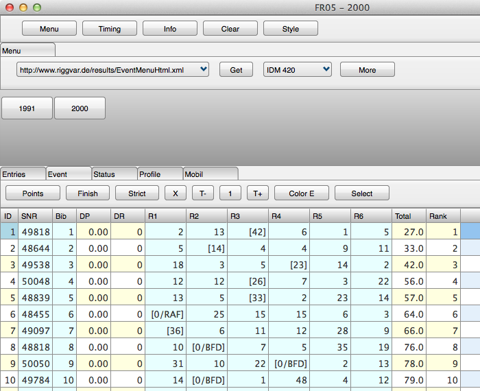



# FR05 für Mac

## Dead End so far

FR05 ist im Prinzip wie FR01, nur kompiliert mit der FMX Bibliothek von Embarcadero (Delphi XE2).
Das Programm konnte für Windows (32 / 64 Bit) sowie für Max OS X (32 Bit) kompiliert werden.

Ein historisches Artefakt.

##### Rant.Begin

Hat aber nicht wirklich gut funktioniert.

Beginnend mit XE3 wurde die Cross Platform Technologie FMX *weiterentwickelt*.
Mit dem Ergebnis, das es überhaupt nicht mehr ging.
Das Problem war das Grid, und die Sockets.
FR hat die normalen Komponenten in einer speziellen Weise verwendet.
Keine Drittpartei Komponenten, aber dafür erweiterte Varianten der mitgelieferten Komponenten.
Die FMX Varianten von Grid und Socket sind leider nicht verwendbar gewesen.
Und das Memo leider auch nicht. Insbesondere das Memo ist essentiell, 
da FR mit Text arbeitet, den ich auch vernünftig editieren möchte.
Das Memo ist inzwischen besser.

Sockets sollten asynchron sein, und einen Event generieren, wenn etwas ankommt, am Besten im Kontext des Haupt-Threads der Application. 
Indy ist blockierend, man müsste es selbst in einen Thread packen.
Das ist nicht das Problem, welches ich lösen wollte.

In Bezug auf das Grid erwarte ich, dass der Benutzer eine einzelne Zelle in den Editier-Modus schalten kann mit F2.
Wenn der User dann fertig ist und committed, dann wird im BO der Tabelle (Collection) eine spezielle Methode aufgerufen und
ein perfekt typisierter Parameter (das Collection-Item) übergeben, und der editierte String.
Damit kann das Programm dann was anfangen.

Das neue FMX Grid unterstützt Stile, und die Implementierung wurde verteilt auf verschiedene Units, 
die auf komplizierte Weise miteinander kommunizieren, über ein neues internes Nachrichtensystem, oder so.

Jedenfalls konnte man nicht einfach einige virtuelle Methoden der Grid-Komponente überschreiben.

Außerdem kann FR im StringGrid den Zellenhintergrund einfärben, und damit Kontext geben.
Das war mit dem FMX Grid auch nicht mehr so einfach.
Ein kommerzielles Grid zu verwenden würde das Problem wahrscheinlich nicht lösen, diese sind hochkomplex,
und ich will eigentlich was einfaches, einfach nur ein StringGrid, ohne Gruppierung, oder so.

> Mit der **Federgraph** Applikation wurde zeitweilig etwas anderes versucht, was mit FMX besser funktioniert hat.

Zukunft für FR auf Mac zur Zeit noch ungeklärt. Java mit Swing geht, C# WPF sollte in Zukunft funktionieren, Swift-Port noch nicht begonnen,
Free Pascal sollte möglich sein, Cross-VCL is kommerziell, obwohl das eventuell funktionieren könnte, ich habe es nicht probiert,
und ich kann es auch gar nicht probieren, da die Community Edition von Delphi das nicht möglich macht, Compiler nicht enthalten,
und ich kaufe kein neues Delphi mehr.

Für Mac sollte es eine native Lösung geben, mit der man direkt auf dem Mac arbeiten kann, X Code oder VS Code oder Visual Studio, oder anders, 
besser wäre besser, mal sehen.

Angular war ein Erfolg. Dort sollten man weitermachen, da lohnt es sich. Hier müssen wir noch warten, soll gesund sein.

##### Rant.End

**ToDo**: Remove Rant. 
