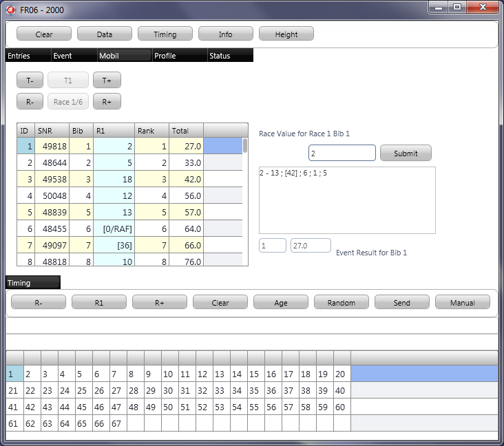



# FR06 für iPad

## Dead End as well

Fehlgeschlagener Versuch mit XE2 iOS.
Im Prinzip eine Tragödie, aber ich denke nicht darüber nach.

**Bemerkung 2019:** Es gibt inzwischen Angular Clienten, die auf iPad benutzt werden können.

> Da wird sich sicherlich noch was tun.

## Update 2012

FR06 ist vergleichbar mit FR01, kompiliert sich aber auch mit FPC 
unter Verwendung der Firemonkey iOS Bibliothek von Embarcadero (Delphi XE2).

FR06 ist eine Kopie von FR01 mit Anpassungen auf dem Weg in Richtung 
IPhone/IPad.

Testen Sie zuerst FR01 unter Windows.
Wenn Sie das Programm auf einer anderen Plattform (iOS, Android, Linux, Mac OS X) probieren wollen, 
bitte ich um Rückmeldung.

Mit FR01 wurde die Funktionalität herausgearbeitet, 
die im Prinzip auch für den Einsatz des Programms auf den Geräten (Devices) zur Verfügung stehen soll.
