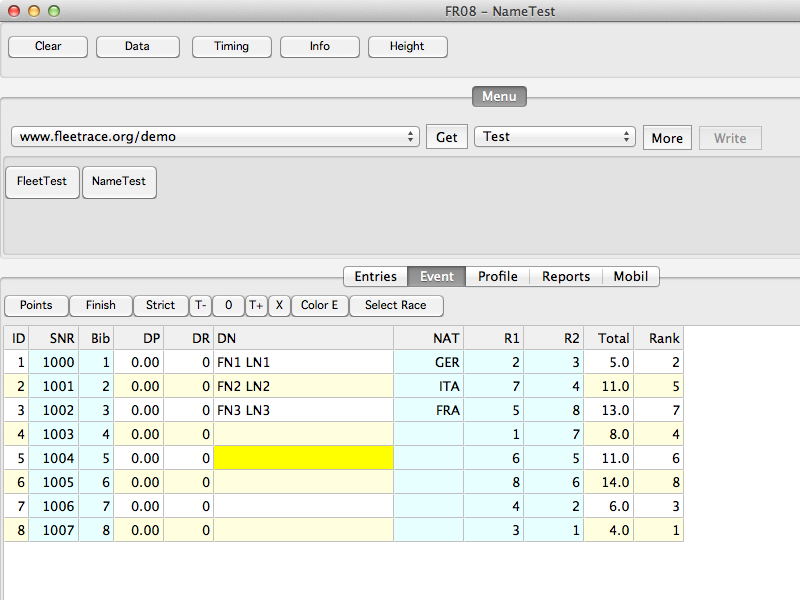



# FR08

FPC Version.

## Update 2019

Wurde lange nicht aktualisiert.

Das Hauptproblem war, dass die Quelle des Programms nicht synchron gehalten werden konnte zwischen Delphi and FPC.
Es gibt ein Spezialprogramm, extra geschrieben, mit dem die Umwandlung automatisch durchgeführt werden kann,
in erster Linie ein automatischer Austausch der Units (mit oder ohne Namespace) in der `Uses` Sektion.
Allerdings müsste ich das gesamte Projekt erst umwandeln, dann Vergleichen, dann zurück wandeln.
Das lässt sich nicht durchhalten. Außerdem bin ich hier auf eine Drittpartei Komponente angewiesen (Sockets),
und das kann ich nicht besonders gut leiden. 

Prinzipiell solle es hier weitergehen.

> But I like C# as well and I like Angular, and I like them all, and that is the 'Problem'.

## Update 2012

FR08 ist vergleichbar mit FR01, nur kompiliert mit FPC (Free Pascal Compiler) in der Lazarus IDE, getestet unter Windows, Mac OS X und Ubuntu.

Möglicherweise ist FR08 zur Zeit die beste Variante für Max OS X.

FR08 läuft gut unter Ubuntu.
