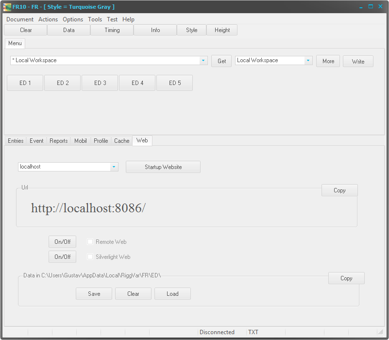



# FR10

FR99 plus FR03.

## Update 2019

Lange nicht gesehen, sieht immer noch gut aus, müsste bestimmt aktualisiert werden, mindestens müsste es umgestellt werden auf Angular anstelle von Silverlight.

But Wait! FR69 hat alles dabei, dort wurde schon auf Angular umgestellt.

Siehe FR03. Was in FR03 ein MainForm ist, wurde hier als Tab hinzugefügt.
Man sollte wissen, dass FR01 und FR99 Event Only Programme sind, also keinen Race Teil haben und damit einfacher sind.
Es hat einen Vorteil FR10 herauszuziehen in dieser Weise, jedenfalls im Prinzip.

In FR69 oder FR62 kann man den Überblick leicht verlieren, zu welchem Feature bestimmte Teile gehören. 
Es sind dort 100.000 Zeilen Quelltext.
Ein Projektvergleich FR69 vs FR10 bzw. FR03 vs FR10 liefert Aufschluss, im Merge Tool.
Die ganzen Varianten, die abgerüsteten Varianten, sind notwendig, um den Überblick zu behalten.

Einer muss den Gesamtüberblick behalten. 
Den Überblick zu gewinnen allein mit FR69 ist schwierig, aber es gibt ja FR01,
und alle können FR69 mit FR01 vergleichen. Da sieht man schon einen Unterschied.
Und den sollte man erst mal sehen, damit fängt es an.
Was in FR10 ergänzt wurde, ausgehend von FR01, das könnten Sie natürlich auf andere Weise ergänzen.
Und manchmal ist es besser, ohne Vorlage genau ein Feature zu ergänzen, zum Beispiel die Implementierung einer Api.

Es macht also Sinn, FR01 zu klonen, und dort zu ergänzen. Genaugenommen schreiben Sie `git clone ... federgraph-delphi` und Sie bekommen sowohl 
FR01 als auch FR69, und können vergleichen.

Ob FR10 von FR01 abgeleitet wurde oder von FR99 lässt sich nicht klar feststellen.
FR01 hat kein Menü, FR10 hat ein Menü, genau wie FR99.
Allerdings sehe ich sofort, das FR10 den Menu Tab hat (oben im North container) in der gleichen Weise wie FR01, 
und dieses Event Menu wurde zuerst für FR01 entwickelt.
FR01 kommt nach FR99, FR100 würde sich außerhalb des erlaubten Bereiches befinden.
FR01 ist das neue FR01.

Siehe [FR90](FR90.html).

Vielleicht sollte man FR10 auch genau so lassen wie es ist.
Manchmal (oft) habe ich den Überblick auch schon verloren, aber ich kenne mich aus in FR69, 
wenn ich es in der Entwicklungsumgebung wieder öffne (Delphi Rio, Community Edition).

Einer, an den ich mich gut erinnern kann, hat mir einen Trick verraten,
in Bezug auf große technische Zeichnungen, wenn Sie davon eine überprüfen sollen:
Sie fangen einfach irgendwo an und rollen es auf.
Das funktioniert, wenn Sie wirklich verstehen wollen wie es funktioniert.
Es gibt noch einen anderen Trick, mit dem Sie schnell feststellen können, wo es einen Fehler gibt,
aber den verrate ich heute nicht. 

> Der ist hier auch gar nicht relevant.

Ist es nicht erstaunlich, wie ich einfach mit drauflos-schreiben das graue Bild von oben *interessant* gemacht habe?

## Update 2012

FR10 ist vergleichbar mit FR01/FR99.

Zusätzlich enthalten ist eine Website für eine Batterie von Events.
Das Programm kann von einem Verein eingesetzt werden, 
um allen Teilnehmern den Zugang zu den aktuellen Ergebnissen zu geben.
