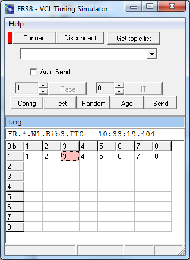



# FR38

FR38 ist ein externer Timing Client, der über das Netzwerk (Tcp) mit einem [FR](FR) Server verbunden werden kann.

Im Prinzip erfolgt die Bedienung immer nach dem gleichen Muster.
Der Benutzer selektiert eine Bib im Grid mit Hilfe von Maus oder Tastatur.
Anschließend wird mit der **Leertaste** die Zeit generiert.

Die Bib ist die Startnummer oder Bugnummer. Da der Race-Teil
im Projekt sportartunabhängig ist, werden die in den meisten
Sportarten üblichen Bezeichnungen verwendet. Mit IT sind die
Zwischenzeiten (Intermediate Timepoint) gemeint. Der Timepoint
auf Index 0 ist das Ziel (IT0). Das Ziel gibt es immer und es
macht Sinn, dass die erste Zwischenzeit IT1 heißt. FT (Finish
Time) als Alias für IT0 ist jedoch immer gültig.

Die Zielposition wird serverseitig aus der Zeit abgeleitet.

Das Telegramm für die generierte Zeit wird zunächst im unteren weißen Textfeld angezeigt.
Mit der Schaltfläche **Send** wird die Zeit gesendet und in das blaue Textfeld übernommen.
Wenn **Auto Send** markiert ist wird die Zeit sofort gesendet.
Sie sollten **Auto Send** abwählen,
wenn Sie das Generieren der Zeit nur ausprobieren wollen.

Die Zeiten sind editierbar.
Sie können Korrekturen vornehmen, bevor Sie die Zeit manuell senden.
Es ist so auch möglich, eine Penaltyzuweisung an eine Bib im Race zu senden.

Es existieren Varianten und Optionen zu FR38.
Beispielsweise kann ein Telegramm auch gleichzeitig an einen Webservice gesendet
oder die Konfiguration der Verbindung vom Webserver geladen werden.

Die Zeit wird bei FR38 manuell im Client generiert,
wobei die Systemzeit des Computers verwendet wird.
Um eine höhere Genauigkeit zu erzielen müssten Sie einen Timer anschließen
und die Daten in das FR [Protokoll](../doc/doc-msg-example) umsetzen.

Für die Konfiguration der Verbindung zum Server benötigen Sie die Parameter Host und Port.
Diese werden in der Konfigurationsdatei gespeichert und können dort auch vorab aktualisiert werden.
Mit dem Button **Test** kann ein Testtelegramm generiert werden,
welches den Zustand des Servers nicht verändert.
Der Button **Random** hilft beim Testen des Systems.
Button **Age** setzt die farbliche Absetzung der bereits verwendeten Nummern zurück.
