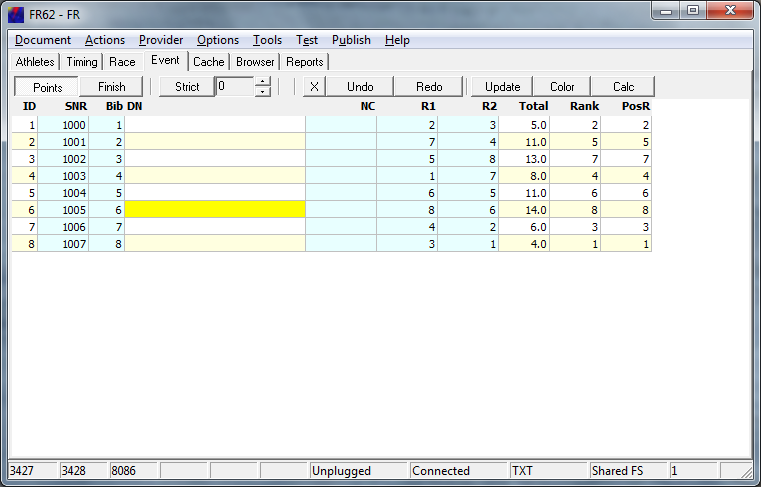
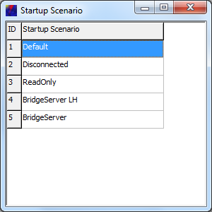
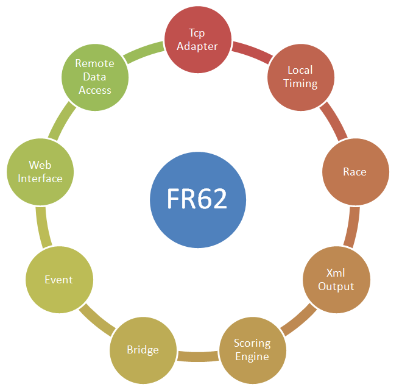
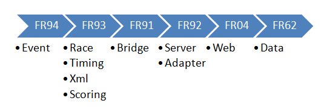



# FR62

## FR Prototyp

FR62 ist die voll ausgebaute Variante und der Ausgangspunkt für abgerüstete Varianten.

In vielen Fällen macht es Sinn, die abgerüsteten Varianten zu benutzen,
die zum Teil ohne Konfiguration betrieben werden können.

Es wurde darauf geachtet, dass sich die abgerüsteten Varianten auf Quelltextebene mit FR62 vergleichen lassen.
Dadurch können Änderungen in das Projekt FR62 zurückgespielt werden, und ich behalte den Überblick,
welche Features in den abgerüsteten Projekten entfernt wurden oder noch enthalten sind.

## Schnelle Konfiguration mit Szenario Manager

FR62 kann durch Konfiguration auf die konkreten Einsatzbedingungen eingestellt werden.
Mit dem Szenario Manager haben Sie Zugriff auf voreingestellte Konfigurationsvarianten.

Beim Start von FR62 können Sie unter folgenden vorkonfigurierten Szenarien wählen:

- **Default**
Die Einstellungen in der Konfigurationsdatei werden gelesen 
und nicht durch spezielle Maßnahmen überschrieben.

- **Disconnected**
Alle serverseitigen Netzwerkverbindungspunkte werden zunächst deaktiviert. 
Das Webinterface kann aber später mit der grafischen Oberfläche aktiviert werden.

- **Read only**
Read only bezieht sich auf das Netzwerk. 
Sie können weiterhin Daten von der Festplatte laden.
Das Home Web, über welches keine Daten verändert werden können, wird aktiviert. 
Remote Web und Silverlight Web werden deaktiviert. 
Tcp Sockets werden deaktiviert. 
Die Konfigurationsdatei wird bei Programmende nicht gespeichert. 

- **Bridgeserver LH**
Bridgeserver wird am *localhost* Interface geöffnet. 
Damit kann auf der lokalen Maschine getestet werden, 
die Anwendung ist nicht über das Netzwerk erreichbar.

- **Bridgeserver**
Bridgeserver wird an allen Netzwerkschnittstellen der lokalen Maschine aktiviert. 
Die Anwendung ist damit vom Bridgeclient aus über das Netzwerk erreichbar.

In der letzten Zeit wurde beim Testen fast immer das Bridgeserver Szenario benutzt.
Damit kann man über das Silverlight Web sofort zum Silverlight Client browsen. 
Der Silverlight Client [FRIA03](../silverlight/FRIA03) kann den Bridge Server nutzen,
um eine direkte TCP-Verbindung zu FR62 aufzubauen.

## Ablageort für gespeicherte Daten

Der Ablageort wird als Workspace bezeichnet. 
FR62 speichert alle Daten in Unterordnern innerhalb des Workspace. 
Normalerweise ist der Workspace ein Ordner im Dokumentenverzeichnis des Benutzers mit dem Namen 'RiggVar Workspace'. 
Damit befinden sich alle gespeicherten Dateien in Ihrem Blickfeld 
und Sie können die Textdateien bearbeiten oder löschen.

Aus Sicht des Programms ist der Workspace über ein Interface erreichbar, 
welches mehrfach implementiert wurde. 
Viele Ablageorte sind damit mindestens lesend erreichbar. 
Der Workspace kann sich z.B. auch in einer Datenbank befinden, 
so dass auf der lokalen Festplatte nichts mehr gespeichert wird. 
Es werden aber immer nur lesbare Textdateien gespeichert.

## Laden von Daten aus dem Web

FR62 kann Daten nicht nur über das Web bereitstellen, sondern auch vom Web laden.

Daten können von jeder Position im Web geladen werden, wo ein gültiges EventMenu.xml erreichbar ist.

Um Daten vom Web zu laden benutzen Sie das Web Menü Feature.
Sie können die Testdaten laden, die auf fleetrace.org abgelegt sind oder mit [FR97](FR97) lokal bereitstellt werden.
Über das Web Menü kann FR62 auch zu sich selbst surfen oder zu einer anderen Instanz des Programms,
welche z.B. auf einem anderen Computer gestartet wurde.

## Bereitstellung von Daten

Alle Netzwerkfunktionen sind optional und können deaktiviert werden. 
Beim ersten Programmstart sind keinen Netzwerkfunktionen aktiv. 
Die eventuell wichtigste Netzwerkfunktion ist die Bereitstellung der Eventdaten über die integrierte Website.

Die in FR62 integrierte Website ist auf die Verwendung des konfigurierten Ablageortes voreingestellt. 
Sie können also ganz normal im Workspace arbeiten, und die Daten, die Sie gerade bearbeiten (Current) 
sowie die Daten, die sich im Workspace befinden sind optional über das Web abrufbar.

Wenn Eventdaten aus dem Workspace publiziert werden, 
dann wird die Umwandlung nach Xml automatisch durchgeführt. 
Auch das EventMenu.xml für den Silverlight Client wird dynamisch generiert.

Die Eventdaten können aus dem lokalen Workspace entnommen 
und als statische Dateien auf einem leistungsfähigen Webserver platziert werden.
Der Silverlight Client [FRIA05](../silverlight/FRIA05) ist möglicherweise der wichtigste Konsument der Eventdaten. 
Er kann sowohl von der in FR62 integrierten Website 
als auch von jeder anderen Website ausgeliefert werden, zusammen mit den Eventdaten.

Unabhängig vom Silverlight Client stellt FR62 über die integrierte Website 
auch direkt vom Browser verwendbare Html Seiten bereit. 
Diese können ebenfalls entnommen und auf einen Webserver hochgeladen werden.

## Sammeln von Daten

Schon ganz am Anfang der Entwicklung konnten die FRXX Programme Timing Daten über das Netzwerk empfangen. 
Die Anbindung an die Datenerfassung könnte der wichtigste Grund für die Verwendung des FR Systems sein. 
Beginnen Sie traditionell mit [FR38](FR38), benutzen Sie ein Browser Widget 
oder testen Sie neue Möglichkeiten mit [FRIA09](../silverlight/FRIA09).
Während Sie Daten für eine einzelne Wettfahrt (Race) empfangen, 
können Sie die aktuellen Bojenrundungen und Zieldurchgänge an interessierte Parteien weiterleiten,
und zwar wieder auf die klassische Weise mit [FR98](FR98),
ganz normal mit Click im Browser oder modern mit [FRIA11](../silverlight/FRIA11).

