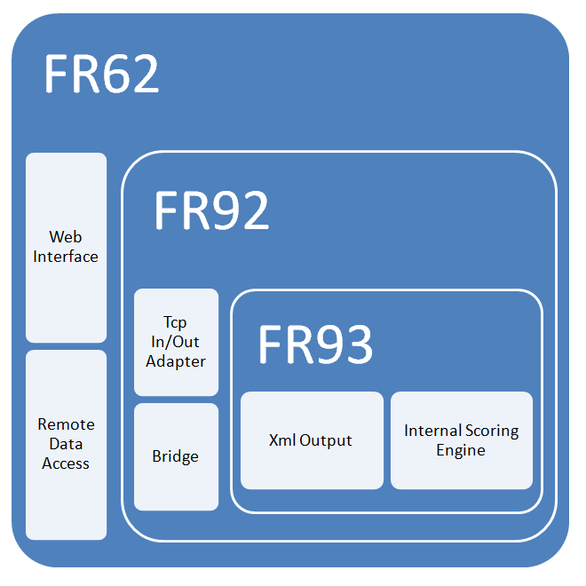



# FR65

FR65 ist wie FR62, nur ohne grafische Oberfläche.

*Im Bild könnte statt FR62 auch FR65 stehen:* 

Es wird aber kein Extra Bild geben, nur für FR65. Das Bild ist gültig für FR62, FR69, UND FR65.

FR65 ist die Windows Service Version des Programms.
Leider zu kompliziert.
Wer soll sich merken, wie die Anwendung mit Hilfe der Kommandozeile gestartet und gestoppt werden soll?
Wer kann sich erinnern, wie man eine solche Anwendung debuggen kann?
Was ist, wenn es Fehler im Programm gibt?
Wer hat Lust sich um die Installation (Registrierung als Service) zu kümmern?

Auf diese Fragen gibt es eine einfache Antwort.
Wenn Sie das sowieso immer machen, dann werden Sie es lieben.

Betrachten Sie jetzt nochmal das Bild. Ist es nicht schön? Es hat was, definitiv.

> Aber FR69 kann mit Doppelklick gestartet werden, und das hat auch was.

PS: Es gibt *.bat Dateien für die Registrierung und Deregistrierung.
Aber woher wollen jetzt wissen, ob das Programm gerade registriert ist?
Und welche Folgen hat es, wenn Sie das Programm löschen ohne es vorher aus der Registrierung zu entfernen?

OK, FR69 kann Ports öffnen, genau wie FR65. Und wenn Sie das Programm entfernen, 
dann werden damit nicht automatisch auch die Einträge in der Firewall für das Programm entfernt.
Das können Sie manuell machen, wenn Sie daran denken.
Wenn Sie nicht daran denken, dann ist es auch noch so, nicht besonders schlimm.
Ein kleiner administrativer Aufwand bleibt bestehen.

Die Alternative wäre es, einen Installer zu verwenden.
Und das würde man machen, wenn das Programm verkauft würde als Produkt, mit Signatur.

Da Sie das Programm selbst kompilieren brauchen Sie keinen Installer.
Sie haben mehr Freiheiten.
