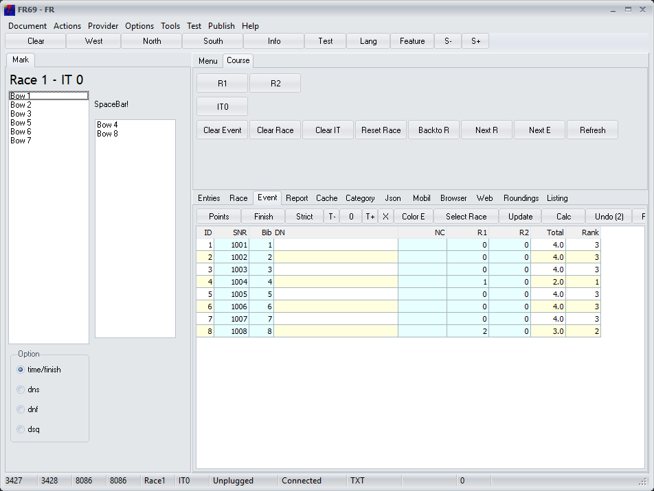



# FR69

Im Quelltext verfügbar auf GitHub.

Enthält alles von FR62 und die letzten Ergänzungen von FR01.
FR69 löst FR62 als **Full** application ab.
Ob alles noch wie früher funktioniert wurde nicht komplett getestet.
Eventuell wird man die abgerüsteten Varianten wieder beleben.