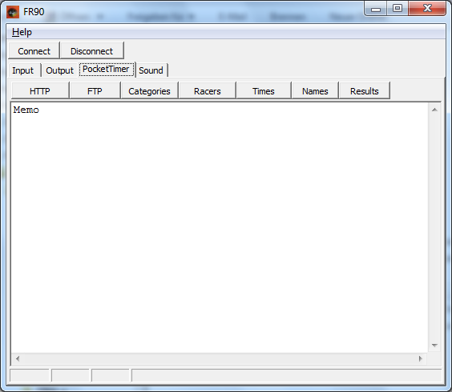



# New FR90

Slot FR90 wurde recycled. Das neue FR90 ist wie FR01, aber mit Web Interface und der Möglichkeit, den Angular Client zu liefern (to serve).

Der Pocket Timer, siehe unten, verdient Respekt. 
Ich wollte damit Zeiten generieren, für FR. 
Das hat auch funktioniert, nachdem ich einen FTP Server dafür gebaut habe.

Allerding ist FR soweit fortgeschritten, dass der Pocket Timer oder ähnliches nicht mehr benötigt wird.
Er wurde auch nie wirklich verwendet, war alles akademisch, zu einer Zeit, wo ich nicht für iPhone kompilieren konnte.

Sie müssen selbst wissen, was Sie an FR anbinden wollen, es sind noch Nummern frei.
FR90 als Nummer ist gut geeignet für das neue FR90, inhaltlich.

# Old FR90

FR90 ist ein Timing Client, der mit einem [FR](FR) Server verbunden werden kann.

Die Besonderheit von FR90 besteht darin, 
dass es die Daten vom Pocket Timer übernehmen kann. 
Pocket Timer Pro ist eine iPhone Applikation, 
mit welcher Zeiten für eine Wettfahrt oder ein Rennen erfasst werden können. 
Da der Pocket Timer die Daten zur Zeit nur an eine FTP-Site senden kann, 
ist ein Hilfsmittel wie FR90 erforderlich, 
um die Daten aus dem IPhone/IPod-Touch herauszuholen.
