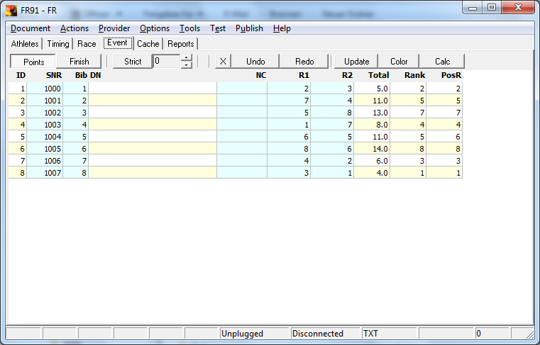
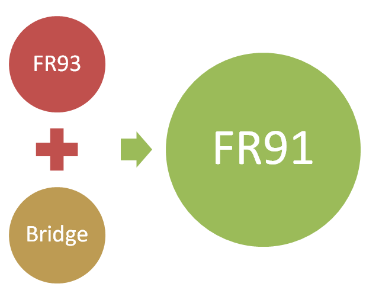
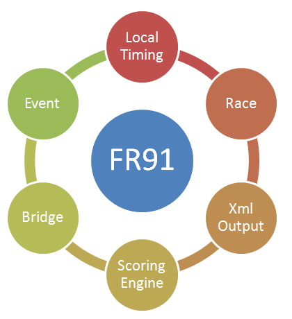



# FR91

FR91 hat folgende Einsatzgebiete:
- Ansicht von Wettkampfdaten.
- Umwandlung von Daten in das FR **Text** Format.
- Umwandlung von Daten in das FR **Xml** Format.

Gegenüber FR92 wurden folgende Features entfernt:
- Adapter
- Web Receiver
- Switch
- Server Bridge

Gegenüber FR93 wurden folgende Features hinzugefügt:
- Client Bridge

Zielstellung für den Zuschnitt von FR91:
- Das Programm soll keine Ports mehr öffnen.

