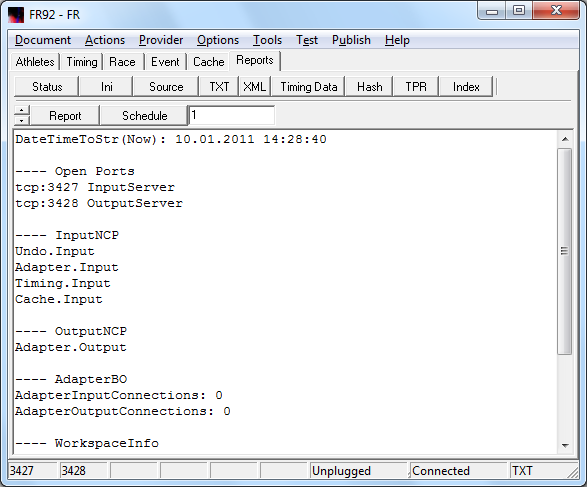
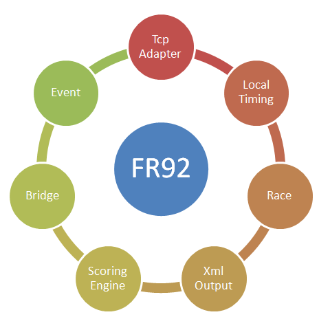
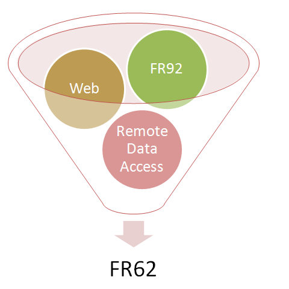



# FR92

FR92 hat folgende Einsatzgebiete:
- Ansicht von Wettkampfdaten.
- Lokale Eingabe von Stammdaten.
- Lokale Eingabe von Timing Daten.
- Lokale Eingabe von Eventdaten.
- Netzwerkgestützte Verarbeitung von Timing Daten.
- Umwandlung von Daten in das FR Text Format.
- Umwandlung von Daten in das FR Xml Format.
- Proxy-Receiver für das Web

Gegenüber FR62 wurden folgende Features entfernt:
- Home Web
- Remote Web
- Silverlight Web
- Browser Page
- Event Menu
- Startup Logger
- Startup Scenario
- Remote Data Access

Folgende Features von FR62 sind noch enthalten:
- Adapter
- Switch
- Bridge
- Web Receiver

Zielstellung für den Zuschnitt von FR92:
- Das Http-Interface wird zurückgebaut.
- Das Tcp-Netzwerk wird erhalten.

* * *

