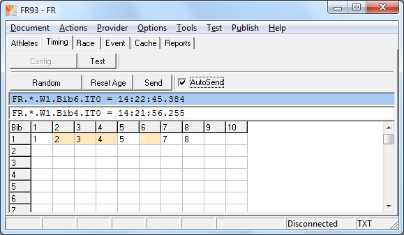
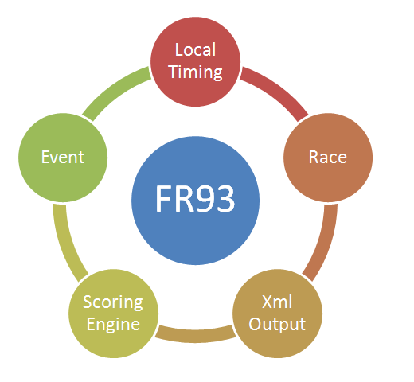



# FR93

FR93 hat folgende Einsatzgebiete:
- Ansicht von Wettkampfdaten.
- Lokale Eingabe von Timing Daten.
- Lokale Eingabe von Eventdaten.
- Umwandlung von Daten in das FR-Txt Format.
- Umwandlung von Daten in das FR-Xml Format.

Gegenüber FR92 wurden folgende Features entfernt:
- Adapter
- Server Bridge

Gegenüber FR91 wurden folgende Features entfernt:
- Client Bridge

Zielstellung für den Zuschnitt von FR93:
- Das Programm soll nur noch lokale Funktionen haben.

Über die Zwischenablage können Sie Daten vom Spreadsheet importieren. 
Daten können auch direkt in das Grid auf den Seiten Entries, Race und Event eingegeben werden.

Die Daten werden als Text oder Xml im Workspace gespeichert. 
Der Workspace befindet sich normalerweise im Dokumentenverzeichnis des Benutzers (Ordner RiggVar Workspace).

Als wichtigstes Ergebnis können Sie die Xml Daten für die Anzeige im Silverlight Client entnehmen.
