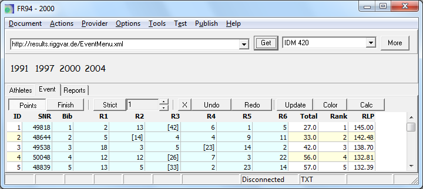
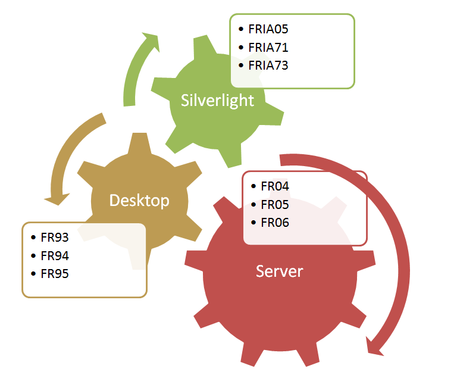



# FR94

## Bemerkung 2019

Interne Scoring Engine *entfernt* bedeutet, dass eine DLL erwartet wird, im gleichen Verzeichnis wie die ausführbare Datei (.exe).
Eine externe Scoring Engine (series scoring number crunching) kann auch mit FR62 verwendet werden, ist dort aber optional.
Eventuelle Probleme mit der Lizenz für den Scoring Code können/konnten damit vermieden werden.

## Von 2012

FR94 hat folgende Einsatzgebiete:
- Ansicht von Wettkampfdaten (nur Event Teil).
- Download von statischen Eventdaten aus dem Web.
- Eingabe von Daten auf Seite Event.
- Umwandlung von Eventdaten aus dem Spreadsheet in das FR Text Format.

Gegenüber FR93 wurden folgende Features entfernt:
- FR XML Format (Ausgabe)
- Race Teil
- Interne Scoring Engine

Gegenüber FR93 wurden folgende Features ergänzt:
- Event Menü

Zielstellungen für den Zuschnitt von FR94:
- Das Programm soll nur noch den Event Teil enthalten.
- Die Scoring Engine (scoring code) soll nicht mehr eingebaut sein.

Nach dem Vorbild des Silverlight Client wurde das Web Menü wieder eingebaut. 
Damit kann FR94 Daten direkt vom Web laden und ist eine Desktopalternative zum Silverlight Client [FRIA05](../silverlight/FRIA05.html).
FR94 hat als kompilierte Win32 Anwendung zurzeit noch einen Geschwindigkeitsvorteil gegenüber dem Silverlight Client.

Bei den vom Web geladenen Daten handelt es sich in der Regel um Daten von abgeschlossenen Wettkämpfen, 
die keine Timing Daten für die einzelnen Rennen enthalten. 
Die Timing Daten (Zwischenzeiten und Zielzeiten) für die einzelnen Wettfahrten 
könnten zum Beispiel nicht erfasst oder aus Platzgründen nachträglich entfernt worden sein.

Wenn das Grid der Silverlight Anwendung zu langsam ist oder zu groß dargestellt wird, 
was auf älteren Rechnern der Fall sein kann, 
dann sollte FR94 immer noch rasend schnell 
und damit für die professionelle Analyse auf dem Notebook geeignet sein.

