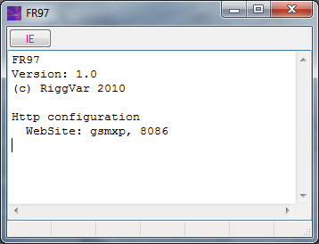
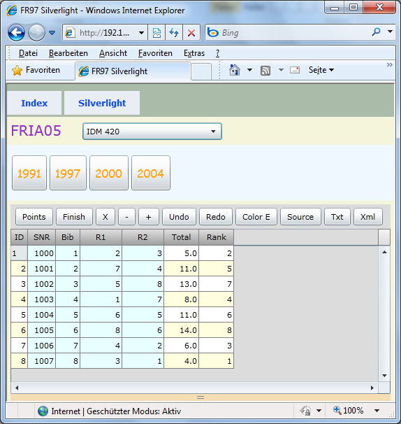
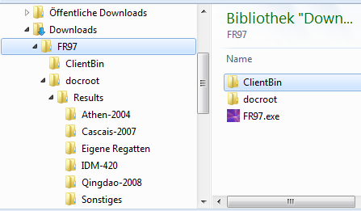



# FR97

Das Produkt das keiner gekauft hat.
Es gab aber auch keine Werbung dafür.

## Das Programm



## Der Silverlight Client

Wird vom Program via http ausgeliefert.



## Die Daten

Die Daten liegen im Unterordner, dicht bei der Anwendung selbst.



## Kurzbeschreibung

FR97 beinhaltet einen minimalen Http-Server auf Basis von Indy TIdHttpServer.

Die Website liefert den [Silverlight Client](../silverlight/FRIA05) aus.
Damit können Benutzer (im Intranet) nach Belieben auf die Resultate zugreifen und diese in der Browsersession verändern.

Die Daten liegen unterhalb der Serveranwendung im Dateisystem.

Das XAP-File für den Silverlight Client (FRIA05.xap) liegt im Ordner ClientBin.

EventMenu.xml und die Datendateien liegen im Ordner docroot/Results.
EventMenu.xml definiert den Inhalt der ComboBox und der Menüleiste in der Silverlight Anwendung.

```
FR97/
    FR97.exe
    ClientBin/
        FRIA05.xap
    docroot/
        Results/
            EventMenu.xml
            Serie01/
                Regatta01.xml
                Regatta02.xml
            Test/
       	        FleetTest.xml
      	        NameTest.xml
            Sonstiges
      	        Meisterschaft.txt
      	        Pokal.txt      	  			
```

FR97 kommt mit einigen Beispieldaten, die der Anwender verändern kann. 
Für die Erstellung der Event-Data Text Dateien oder Event-Data Xml Dateien sind die FR Desktopanwendungen geeignet. 
Die Dateien enthalten nur Eingangsdaten, sie können daher auch von Hand erstellt werden.
Die Berechnung der Ergebnisse findet im Silverlight Client statt.