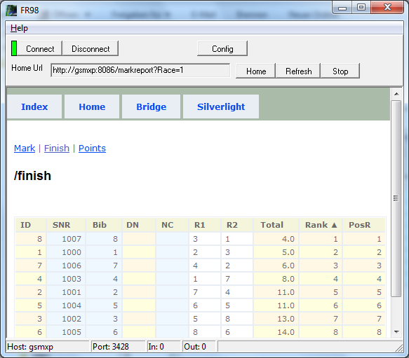



# FR98

FR98 ist zur Abwechslung einmal keine abgerüstete Variante von FR62.

FR98 ist ein klassischer Output Client. 
Er verbindet sich via tcp mit einem Result Server [FR04](FR04)|FR62|FR63|FR65|FR92 der über ein eingebautes Web Interface verfügt
und *zieht* sich Berichte (reports).

Die Berichte liegen in der Regel im html Format vor 
und können im eingebetteten Browser (browser component) dargestellt werden. 
Wenn neue Reports automatisch angefordert werden aktualisiert sich die Anzeige im Fenster praktisch wie von selbst.

> Der Silverlight Client FRIA03 kann via tcp die gleichen Nachrichten/Benachrichtigungen erhalten wie FR98, rechnet aber selbst. 

Im Gegensatz zu FRIA03 ist FR98 ein schlanker Client, der die Anzeige nicht selbst generiert/berechnet!

Nach dem gleichen Prinzip könnte man Varianten erstellen. 
Ob die angeforderten Reports über tcp ausgeliefert werden oder über http macht prinzipiell keinen Unterschied.

Wenn man einen generischen Report (Xml) anfordert kann man abgeleitete Reports auch innerhalb des Output Clienten erzeugen. 
Da das Protokoll und das Format der FR Nachrichten offen liegt können Sie sich selbst einen Clienten bauen. 
Eventuell kann FR98 dafür Ausgangspunkt dienen.

Aber der Punkt war doch, das der Client rechnen soll, oder etwa nicht?