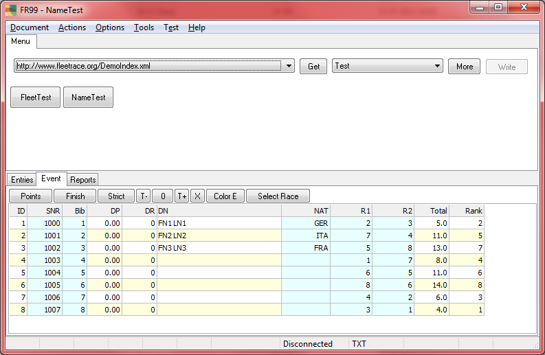



# FR99

Mehr geht nicht, nach FR99 fängt es bei FR01 wieder an.

## Update 2012

FR99 ist vergleichbar mit FR01, nur hat es zusätzliche Features.

Zusätzlich enthalten sind einige Dialoge zur Einstellung von
Parametern für den geladenen Event. Damit ist das Programm zur
Vorbereitung der Event Daten geeignet. Stammdaten können von Excel
übernommen werden. Das Ergebnis (Text/Html) kann im Internet zur
Verfügung gestellt bzw. mit Hilfe von FR01 konsumiert und ergänzt
werden. Ein einfacher Texteditor würde es auch tun. Bei Verwendung
von FR99 können Sie aber davon ausgehen, dass der generierte Text
keine Syntaxfehler enthält.

Das Programm verwaltet einen lokalen Workspace in AppData/Local.

Auch FR01 kann mit Daten in Dateien auf der Festplatte arbeiten,
Sie müssen dazu nur eine Url zum lokalen Workspace konfigurieren.
Bei FR99 ist der spezielle lokale Workspace jedoch fest eingebaut
und so eingerichtet, dass er mit dem Workspace von FR02 überlappt.
(Bei FR01 steht der Konsum von Daten aus dem Internet im
Vordergrund. Es soll im Normalfall nichts lokal gespeichert werden).

Das Programm FR99 kann bei Bedarf angepasst werden, so dass es
optimal mit Ihrem Server zusammenarbeitet.

## Update 2019

Das müssten Sie dann selbst machen, ausgehend von FR01 oder FR69.

Im Bild sieht man, dass FR99 eine **Main Menu** Komponente hat. FR01 hat kein Main Menu.
Deshalb ist es auch einfacher in FR99 zusätzliche Dialogfenster aufzurufen.
Diese müssten dann aber auch dokumentiert werden, woraus folgt,
dass FR01 gar nicht so schlecht ist.
Your mileage may vary.
