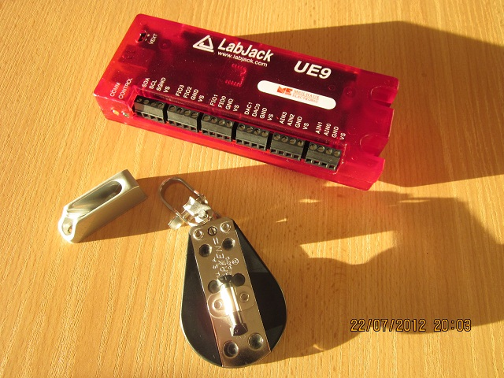

# Blog

Teilweise recycled vom alten blog (2006):

<ul>
<li><a href="beispiel-daten-herunterladen.html">beispiel-daten-herunterlanden</a></li>
<li><a href="bib-oder-bow.html">bib-oder-bow</a></li>
<li><a href="daten-format.html">daten-format</a></li>
<li><a href="event-props-einstellen.html">event-props-einstellen</a></li>
<li><a href="fr01-update-2.html">fr01-update-2</a></li>
<li><a href="lokaler-workspace.html">lokaler-workspace</a></li>
<li><a href="mehr-oder-weniger.html">mehr-oder-weniger</a></li>
<li><a href="mit-excel-arbeiten.html">mit-excel-arbeiten</a></li>
<li><a href="neustart.html">neustart</a></li>
<li><a href="skip-download-und-import.html">skip-download-und-import</a></li>
<li><a href="vorlage-lokaler-workspace.html">vorlage-lokaler-workspace</a></li>
<li><a href="warum-500.html">warum-500</a></li>
<li><a href="zieleinlauf-eingeben.html">zieleinlauf-eingeben</a></li>
</ul>

