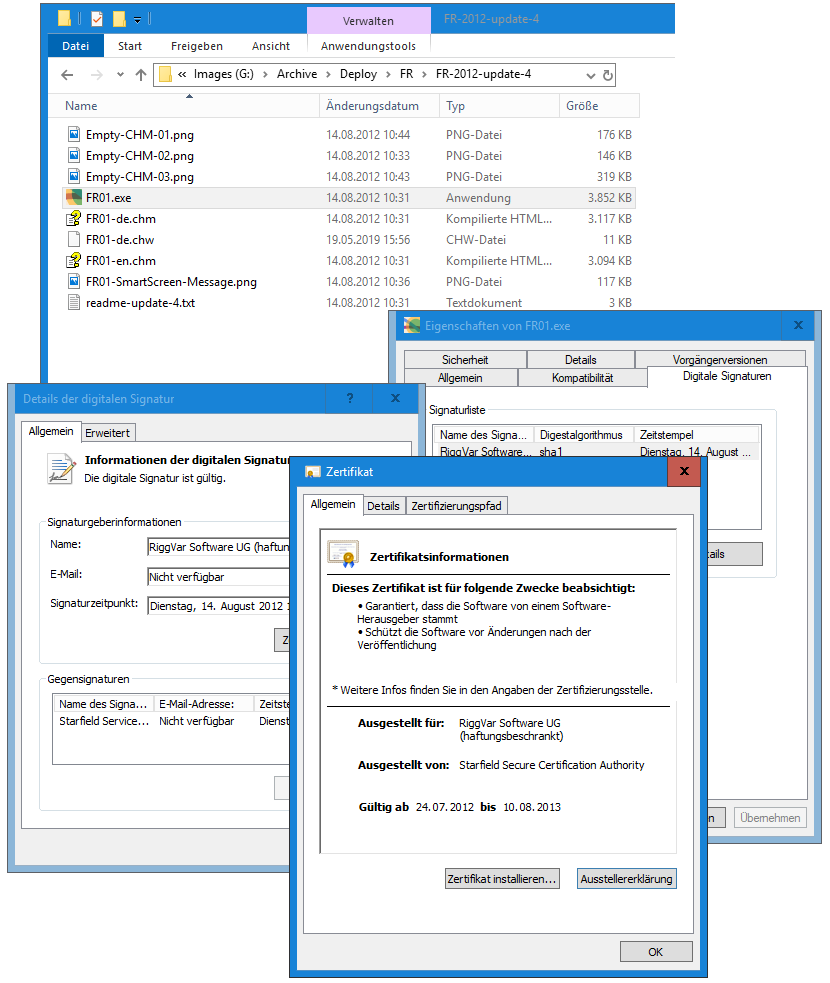

# FR01 Ältere Updates

Ich habe noch ein *Blog Post* gefunden, zu Update 2 !

Und dann will ich auch noch Update 4 abhandeln, weil es das gab.

## Update 2

Die wichtigste Neuerung in Update 2 ist der **Read** Button auf *Seite Menu*.
Damit können Sie im **Memo** veränderte Daten direkt wieder laden.

Auf *Seite Report* wurden zwei Buttons ergänzt,
mit denen das Trennzeichen in den CSV-Listen im Memo umgeschaltet werden kann.
Der Austausch von Daten mit Excel wird dadurch einfacher.

1. Bevor Sie Daten für Excel herauskopieren schalten Sie auf Separator **Tab**.
2. Nachdem Sie Daten von Excel hereinkopiert haben schalten Sie wieder zurück auf Separator **Semikolon**, um die neuen 
Daten mit dem Button Read in die Applikation eingelesen zu können.

## Update 4

Das *letzte* Update war Update 4, vom Juli 2012.

### About readme-update-4.txt

```
#==========================================================================#
# readme for fr01-win32-update-4                                           #
#                                                                          #
#      F                                                                   #
#     * * *                                                                #
#    *   *   G                                                             #
#   *     * *   *                                                          #  
#  E - - - H - - - I                                                       #  
#   *     * *         *                                                    #
#    *   *   *           *                                                 #
#     * *     *             *                                              #
#      D-------A---------------B                                           #
#               *                                                          #
#               (C) RiggVar Software (haftungsbeschränkt)                  #
#                                                                          # 
===========================================================================#

this is an update for FR01.exe

changes in update 4 - build number 1.0.4609.37454
=================================================
- Help file added

- Added batch process for the whole workspace to Tab Cache.
  Tab Cache can save files (xml, html, txt) to folder <User documents>\FR\Cache.
  Tab Cache is hidden by default.
 
changes in update 3 - build number 1.0.4580.50956
=================================================
- Tab Cache added.

- Tab Profile updated.

- Feature to activate hidden/disabled items added.

  The following Items are now invisible/disabled by default:

  Button Clear
  Button Style
  Button More
  Button Write
  Button Read
  Tab Profile
  Tab Mobil
  
- The bottom Memo on page Report (StatusMemo) now supports more keyboard shortcuts.

  Ctrl a - select all
  Ctrl t - replace semicolons by tab
  Ctrl s - replace tabs by semicolon

The Toolbar-Buttons for replacing tabs and semicolons (useful when working with Excel)
have been removed - use the keyboard shortcuts.
```
Ich habe die readme siehe oben etwas gekürzt, die Lizenz Info herausgelöscht, weil nicht mehr relevant, jetzt ist alles GPL 3.0.

### About FR01.exe in Update 4

Update 4 kam als zip Datei und enthielt folgendes, weniger der Bilder vom Test:

*Inhalt von fr01-win32-update-4.zip, nach Testlauf, mit Screenshots vom Test.*<br>


Die ausführbare Datei **FR01.exe**, wenn mit zip Datei vom Internet bezogen, musste vom Benutzer freigeschalten werden.
Anstatt weitere große Bilder vom Test einzufügen, hier das *Transskript* des Dialogfeldes vom Freischalten:

```
Windows protected your PC

Windows SmartScreen prevented an unrecognized app from starting.
Running this app might put your PC at rist.

Publisher: RiggVar Software UG (haftungsbeschrankt)
App: FR01.exe

[Run anyway] [Don't run]
```

> I clicked on **Run anyway**, because I trusted my own program.

### About FR01-de.chm in Update 4

Die Hilfe-Datei **FR01-de.chm** war nicht signiert und zeigte nach dem ersten Öffnen einen leeren weißen Inhaltsbereich.
Das Inhaltsverzeichnis war zu sehen, die Html Inhalts-Seiten nicht.

Die Hilfe-Datei konnte aber ebenfalls *freigeschalten* werden, 
mit Rechtsklick, dann auf *Eigenschaften von Datei*, am Ende mit **Open** im Dialog.

```
Open File - Security Warning

Name: C:\Users\UserName\Downloads\Update-4\FR01-de.chm
Publisher: Unknown Publisher
Type: Compiled HTML Help File
From: C:\Users\UserName\Downloads\Update-4\FR01-de.chm

[Open] [Cancel]
```

## MSI Pakete

Mit einem signierten `.msi` Installer Paket wäre es einfacher gewesen, und es gab Installations-Pakete für fast alle Varianten von FR, zum Beispiel:

- FR38Setup.msi (signiert Dienstag, 19. April 2011 15:54:45)
- FR94Setup.msi (signiert Mittwoch, 1. Juni 2011 08:14:15)

## Windows Store

Heute wird empfohlen, die Anwendungen als `.appx` Paket im Microsoft Store zu veröffentlichen, wobei Microsoft die Anwendungen prüfen und signieren wird.

Denn wird die App am neuen Standard-Ort installiert, irgendwo, es ist möglich herauszufinden wo. Das macht auch alles Sinn!

## Fazit

> Kompilieren Sie selbst.

Ansonsten gibt es offene Fragen, darunter die Frage nach dem vertretbaren Aufwand, und die Frage der Flexibilität.

Es kann immer noch sinnvoll sein:
- einen Ordner a`D:\Fleetrace\` anzulegen
- eine zip Datei mit FR01 dort zu entpacken
- eventuell sogar zusammen mit Beispieldaten

Die Hilfe-Datei ist jetzt hier.

> [Angular FR](../angular/FREO.html) ist das neue FR01, welches nicht installiert werden muss.

Mit FR69 ist es etwas komplizierter.

[Zurück zum Blog Index](blog-index.html)