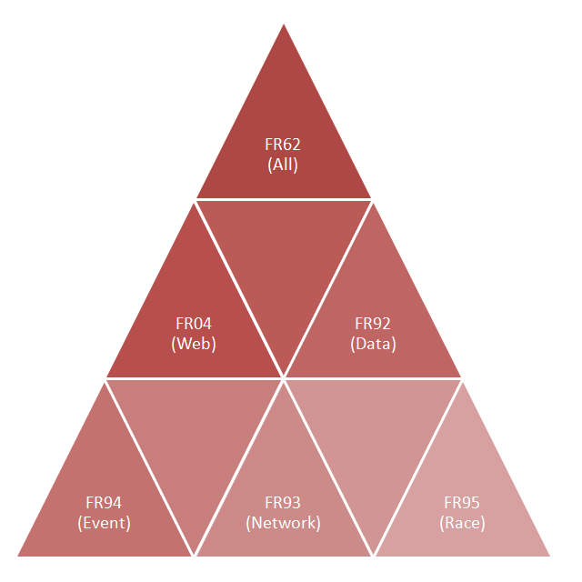

# Komponenten

Zum Projekt FR gehören:
- normale Desktop Anwendungen,
- Server Anwendungen,
- Timing Clienten,
- Web Anwendungen
- und SPA Clienten.

Der SPA Client für das Fleetrace Projekt wird auch als Fleetrace Internetapplikation **FRIA** bezeichnet.
Vom SPA Client gibt es mehrere Varianten, aktive und passive.

Der SPA Client als letztes Glied in der Kette kann auch solo genutzt werden, 
zum Beispiel zur Anzeige von statischen Regattaergebnissen.

Statisch bedeutet dabei, dass die Eingangsdaten unveränderbar auf einem Webserver bereitgestellt werden.

Im SPA Client werden die Ergebnisse jedoch dynamisch berechnet und können auch nachträglich zum Leben erweckt werden.

SPA Client war 2012 eine Silverlight Anwendung.
Ab 2018 wird er durch Angular Apps abgelöst.

Alte Dokumentation:

- [FRIA](silverlight/FRIA.html)
- [FRIA Schnellstart](doc/doc-fria-quick-start.html)

Neue Dokumentation ist *geplant* !

## Liste der Komponenten

<dl>
<dt><a href="applications/FR04.html">FR04</a></dt>
<dd>Result Server, abgerüstete Variante, speichert nichts auf der Festplatte,
ohne Konfiguration, mit fest eingestelltem Szenario (Bridgeserver für FRIA).</dd>

<dt><a href="applications/FR38.html">FR38</a></dt>
<dd>Timing Client, sendet einzeilige Nachrichten.</dd>

<dt><a href="applications/FR62.html">FR62</a></dt>
<dd>Result Server, voll aufgerüstet, mit Szenario Manager für konfigurationsfreien
Betrieb. Integrierte Website kann Tcp-Inputclient und Tcp Output Client ersetzen.</dd>

<dt><a href="applications/FR63.html">FR63</a></dt>
<dd>Wie FR62, aber graphische Oberfläche ist leer. Dieses Programm kann zum
Einsatz kommen, wenn kein Bedienpersonal vor Ort am Computer sitzt. Sie nutzen
dann ausschließlich die Serverfunktionalität des Programms. Die Steuerung kann
über ein Webinterface erfolgen (Browser).</dd>

<dt>FR64</dt>
<dd>FR als Webanwendung. Je nach Plattform ausgeführt als ASP.NET generic
handler, Java servlet oder (historisch) Delphi ISAPI DLL. Diese Anwendung steht
für spezielle Einsatzfälle zur Verfügung. Es empfiehlt sich mit einer der
Desktopanwendungen zu beginnen.</dd>

<dt>FR65</dt>
<dd>Wie FR63, als Windows Service.</dd>

<dt><a href="applications/FR90.html">FR90</a></dt>
<dd>Timing Simulator + Pocket Timer Adapter.</dd>

<dt><a href="applications/FR93.html">FR93</a></dt>
<dd>FR62 minus Switch, Bridge. Dieses Programm ist eine alleinstehende
Desktopanwendung. Die Funktion der automatischen Synchronisation von Daten mit
parallellaufenden Anwendungen wurde aus FR93 entfernt.</dd>

<dt><a href="applications/FR94.html">FR94</a></dt>
<dd>FR62 minus Timing, Race, Switch, Bridge, Cache, Browser und Output. Es ist
nur noch der sportartspezifische Eventteil enthalten. Dieses Programm kann für
den Import und die Weiterbearbeitung von Spreadsheet Daten benutzt werden.</dd>

<dt><a href="applications/FR95.html">FR95</a></dt>
<dd>FR62 minus Event, Switch, Bridge, Cache, Browser und Output. Es ist also nur
noch der sportartunabhängige Race Teil enthalten. Dieses Programm kann für viele
Timing Aufgaben eingesetzt werden.</dd>

<dt><a href="applications/FR97.html">FR97</a></dt>
<dd>Anwendung mit IdHttpServer, minimaler ad hoc Webserver für FRIA-Client und xml.</dd>

<dt><a href="applications/FR98.html">FR98</a></dt>
<dd>Traditioneller Output Client. Wird benachrichtigt, zieht sich Reports.</dd>

<dt>FRWA01</dt>
<dd>Dynamische Website, ASP.NET MVC, liefert FRIA-Client, holt archivierte Daten
für FRIA aus der Datenbank.</dd>

<dt>FRWA02</dt>
<dd>Statische Website, liefert FRIA-Client, liest xml für FRIA vom Dateisystem.</dd>

<dt><a href="silverlight/FRIA03.html">FRIA03</a></dt>
<dd>Silverlight RIA, zeigt Eventpage, manuell verbunden mit Result Server.</dd>

<dt><a href="silverlight/FRIA05.html">FRIA05</a></dt>
<dd>Silverlight RIA, mit Eventpage, ausgelegt für das Herunterladen statischer
Daten. Kann in normale Website integriert werden.</dd>

<dt><a href="silverlight/FRIA11.html">FRIA11</a></dt>
<dd>Silverlight RIA, zeigt Race Page, manuell verbunden mit Result Server.</dd>

</dl>
