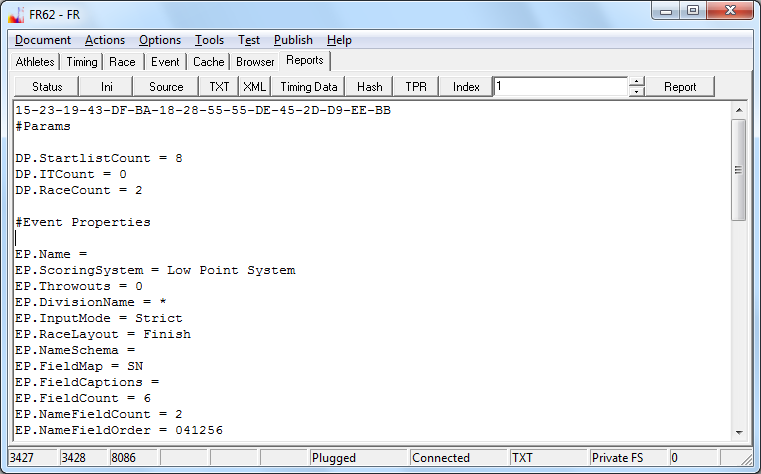

# Datenexport

Es ist nicht schwierig, die Daten in einem Format bereitzustellen, das von 
den FR Programmen gelesen werden kann. Daten können im Text- und Xml-Format 
bereitgestellt werden. Das Utf-8 kodierte Xml ist das bevorzugte 
Austauschformat.

Im Prinzip besteht die Datei aus einer Anzahl von Tabellen: der Startliste, 
der Flottenliste, der Liste mit den Namen (der Athleten/Entries), der Liste der 
Zielpositionen und der Liste der Penalty-Zuweisungen.

Bei einem gezeiteten Rennen werden zusätzlich eine Anzahl Tabellen mit den 
Zwischenzeiten eingefügt. Die Zwischenzeiten nehmen in der Regel den meisten 
Platz ein.

Die Beispiele beantworten eigentlich alle Fragen, wie die Tabellen 
herauszuschreiben sind.

Mit dem Button TXT auf Seite Reports im Programm können Sie sich jederzeit 
einen Auszug der Event-Daten generieren. Die Xml-Version enthält die gleiche 
Information.

Die erste Zeile der Ausgabe im Memo enthält einen Hash über die berechneten 
Ergebnisse, welcher zum Vergleich benutzt werden kann. Diese Zeile wird nicht 
gespeichert. Die Zeilen mit einem Doppelkreuz sind Kommentare und können 
ignoriert werden.



Nachfolgend der komplette Text-Auszug der Standard-Event-Daten:
```
#Params

DP.StartlistCount = 8
DP.ITCount = 0
DP.RaceCount = 2

#Event Properties

EP.Name = 
EP.ScoringSystem = Low Point System
EP.Throwouts = 0
EP.DivisionName = *
EP.InputMode = Strict
EP.RaceLayout = Finish
EP.NameSchema = 
EP.FieldMap = SN
EP.FieldCaptions = 
EP.FieldCount = 6
EP.NameFieldCount = 2
EP.NameFieldOrder = 041256
EP.UseFleets = False
EP.TargetFleetSize = 8
EP.FirstFinalRace = 20
EP.IsTimed = False
EP.UseCompactFormat = True

NameList.Begin
NameList.End

StartList.Begin
Pos;SNR;Bib
1;1000;1
2;1001;2
3;1002;3
4;1003;4
5;1004;5
6;1005;6
7;1006;7
8;1007;8
StartList.End

FinishList.Begin
SNR;Bib;R1;R2
1000;1;2;3
1001;2;7;4
1002;3;5;8
1003;4;1;7
1004;5;6;5
1005;6;8;6
1006;7;4;2
1007;8;3;1
FinishList.End

#W1

#W2

EP.IM = Strict
```

Unterhalb der Kommentare #W1 und #W2 würde man die Penalty-Zuweisungen 
eintragen, wenn vorhanden. Die Zeile EP.IM = Strict ist eine Anweisung an das 
Programm, ein Umschalten in den Strict Eingabemodus zu versuchen. Die Listen 
zwischen *.Begin und *.End können theoretisch mit einem Spreadsheet vorbereitet 
werden. Diese Listen sind hier im kompakten Text-Format angegeben. Mehr zum 
kompakten Text-Format finden Sie im Artikel 
über die [Nachrichtenspezifikation](doc-msg-example).

Die Parameter (Division-Properties) müssen immer ganz oben stehen, so dass 
sie vor allen anderen Angaben gelesen werden. Unter Verwendung der Parametern 
wird Speicher zugewiesen.

```
#Params

DP.StartlistCount = 8
DP.ITCount = 0
DP.RaceCount = 2
```

RaceCount definiert die Anzahl der Wettfahrten des Events. ITCount definiert 
die Anzahl der Zwischenzeiten für ein Rennen und gilt für alle Rennen des 
Events. StartlistCount definiert die Anzahl der Entries im Event und gilt für 
alle Rennen des Events. Die Anzahl der Zeilen in der Nachschlagetabelle für die 
Namen ist davon völlig unabhängig. Diese Zahl ist dynamisch und in den 
Event-Parametern nicht angegeben.

Im Folgenden konzentriere ich mich auf die Erläuterung der Eigenschaften des 
Events, die den tabellarischen Daten vorangestellt sind. Hier können eventuell 
nachträglich auch die Feinheiten bezüglich der Darstellung eingestellt werden.

```
#Event Properties

EP.Name = 
EP.ScoringSystem = Low Point System
EP.Throwouts = 0
EP.DivisionName = *
EP.InputMode = Strict
EP.RaceLayout = Finish
EP.NameSchema = 
EP.FieldMap = SN
EP.FieldCaptions = 
EP.FieldCount = 6
EP.NameFieldCount = 2
EP.NameFieldOrder = 041256
EP.UseFleets = False
EP.TargetFleetSize = 8
EP.FirstFinalRace = 20
EP.IsTimed = False
EP.UseCompactFormat = True
```

Die Event Properties (EP) müssen natürlich mit dem Event gespeichert werden. 
Davon gibt es eine ganze Liste:

<dl>
<dt>EP.Name</dt>
<dd>Enthält den Namen des Events. Der Name hat keinen Einfluss auf die 
Berechnung des Ergebnisses, erscheint aber eventuell auf den Reports.</dd>

<dt>EP.ScoringSystem</dt>
<dd>Mit dieser Angabe kann das zu verwendende Scoring-System selektiert werden. 
Welche Scoring-Systeme zur Verfügung stehen hängt von der verwendeten 
Scoring-Engine ab. Die standardmäßig verwendete Scoring-Engine implementierte 
die Werte 'Low Point System', 'Bonus System' und 'Bonus System DSV'.</dd>

<dt>EP.Throwouts</dt>
<dd>Enthält die Anzahl der zu streichenden Wettfahrten. Diese Angabe wird zur 
Scoring-Engine durchgestellt.</dd>

<dt>EP.DivisionName</dt>
<dd>Die Division entspricht dem zweiten Feld in der Telegramm-Definition. Im 
Zweifelsfall ist die Angabe * immer richtig. Die Angabe * steht für die anonyme 
Division. Telegramme für die anonyme Division werden immer akzeptiert. Ansonsten 
werden nur Telegramme akzeptiert, die der angegebenen Division entsprechen. Die 
Division entspricht im Prinzip der Bootsklasse, sollte aber keine Sonderzeichen 
enthalten. Wie gesagt, für den Zweck des Datenimports ist * die beste Wahl.
</dd>

<dt>EP.InputMode</dt>
<dd>Wenn die Daten geschrieben werden, dann wird hier die aktuelle Einstellung 
des Programms eingetragen. Dieser Wert ist ohne Bedeutung für den Datenimport.</dd>

<dt>EP.RaceLayout</dt>
<dd>RaceLayout bezieht sich auf das Event-Tableau und kann die Werte Finish oder 
Points annehmen. Wenn die Daten geschrieben werden, dann wird hier die aktuelle 
Einstellung des Programms eingetragen. Der Wert ist ohne Bedeutung für den 
Datenimport.</dd>

<dt>EP.NameSchema</dt>
<dd>Beim Schema für die Zuweisung der Namen wird zwischen NX und Default 
unterschieden. NX ist zu empfehlen, dann werden die einzelnen Spalten für die 
Namen mit N1, N2, usw. bezeichnet. Beim Default Schema sind die Spalten 
FN,LN,SN,NC,GR,PB fest vorgegeben. Die NX Bezeichnungen sind aber immer gültig. 
Das Angabe des Schemas wird in erster Linie beim Export verwendet. Für den 
Datenimport wird die Verwendung von NX empfohlen. Mehr dazu ist im extra Thema 
über die Namen zu lesen.
</dd>

<dt>EP.FieldMap</dt>
<dd>Es gibt eine virtuelle Spalte DN (Display-Name). Welche Werte in diese 
Spalte projiziert werden, kann hier angegeben werden. Mehr dazu ist im Artikel 
über Namen dokumentiert.</dd>

<dt>EP.FieldCaptions</dt>
<dd>Damit können Sie die Bezeichnungen der Namens-Spalten für die Ausgabe auf 
den Reports überschreiben. NX wird also durch die angegebene Bezeichnung 
ersetzt. Siehe EP.NameFieldOrder. Die erste Angabe in der komma-getrennten Liste 
ist die Bezeichnung für die erste auf dem Report erscheinende Namenspalte. Die 
Anzahl der Angaben in der Liste soll EP.NameFieldCount entsprechen.</dd>

<dt>EP.FieldCount</dt>
<dd>Angabe über die Anzahl der verwendeten Namenspalten. Standard ist 6.</dd>

<dt>EP.NameFieldCount</dt>
<dd>Die Anzahl der Namens-Spalten, die auf den Reports erscheinen soll.</dd>

<dt>EP.NameFieldOrder</dt>
<dd>Die Festlegung, welche Spalten auf den Reports ausgegeben werden sollen. Die 
Anzahl der Komma-getrennten Indexwerte sollte mindestens die Länge von 
EP.NameFieldCount haben. 
Mehr Informationen dazu sind im Artikel über die <a href="doc-entry-names.html">Namen</a> zu finden.
Die Spalte DN (DisplayName) hat Index 0. Die anderen 
Spalten haben Index X, entsprechend der Spaltenbezeichnung NX.</dd>

<dt>EP.UseFleets</dt>
<dd>Legt fest, ob der Event in Gruppen gesegelt wird. Wenn ja, dann wird später 
eine Tabelle mit den Flotten-Zuweisungen erwartet und ausgewertet.</dd>

<dt>EP.TargetFleetSize</dt>
<dd>Hat eine Bedeutung, wenn EP.UseFleets auf True steht. Gibt die Größe der 
Gruppen an. Dieser Wert wird der Scoring-Engine zur Verfügung gestellt und hat 
zum Beispiel Auswirkung auf die Punktanzahl eines Bootes mit Penalty dsq. 
Sollten keine Gruppen verwendet werden, dann macht es Sinn, den Standardwert 8 
unverändert zu lassen.</dd>

<dt>EP.FirstFinalRace</dt>
<dd>Wird ebenfalls an die Scoring-Engine weitergereicht. Sollten keine Gruppen 
verwendet werden, dann wird empfohlen, den Standardwert 20 einzutragen.</dd>

<dt>EP.IsTimed</dt>
<dd>Wenn IsTimed auf False gestellt wird, dann speichert das Programm keine 
Zwischenzeiten. Die eventuell vorhandenen Zwischenzeiten werden damit entfernt. 
Sollten Sie Tabellen mit Zwischenzeiten bereitstellen, dann setzen Sie 
EP.IsTimed auf True.
</dd>

<dt>EP.UseCompactFormat</dt>
<dd>Muss auf True stehen, wenn XML oder das kompakte Text-Format verwendet wird.</dd>

</dl>

Einige Event-Properties werden nur geschrieben, wenn sie vom Standardwert 
abweichen. Das betrifft unter anderem Meta-Informationen zum Event (Datum, Ort), 
Angaben zur Darstellung in den Reports (ShowCupColumn) und Angaben zu optionalen 
Berechnungen (Uniqua-Ranglisten-Berechnung). Diese Properties müssen beim 
Datenimport nicht angegeben werden. Sie können in der grafischen Oberfläche mit 
Dialogen eingestellt werden, und erscheinen dann automatisch im Text/Xml.

Der Datentyp der Properties (Boolean, Numerisch/Integer, String) ist in den 
Beispielen zu erkennen. Der Wert eines booleschen Feldes (Wahrheitswert) wird mit True 
oder False angegeben, wobei in der Regel intern nur das T für True ausgewertet 
wird. Im Zweifelsfall sind die Werte so wie vom Programm ausgegeben anzugeben.

Eine Liste dieser optionalen Werte ist nachfolgend angegeben:

<dl>

<dt>EP.ShowPosRColumn</dt>
<dd>PosR ist die Spalte mit der Angabe des eindeutigen Rankings, d.h. mit 
garantierter Auflösung aller Tiebreaks. Die Auflösung der Tiebreaks erfolgt in 
letzter Instanz unabhängig von der Scoring-Engine. Die Anzeige dieser Spalte 
sollte in fast allen Fällen unterdrückt werden, kann aber bei Verwendung von 
Gruppen die Punkte unabhängig von der Gruppenzugehörigkeit sortieren.</dd>

<dt>EP.ShowCupColumn</dt>
<dd>Regelt die Anzeige der Spalte für die Ranglistenpunkte.</dd>

<dt>EP.Uniqua.Faktor</dt>
<dd>Der Faktor für die Regatta.</dd>

<dt>EP.Uniqua.Enabled</dt>
<dd>Die Angaben für Uniqua.Gesegelt/Gezeitet/Gemeldet können eigentlich auch vom 
Programm ermittelt/vorgeschlagen werden. Uniqua.Enabled True gibt an, dass die 
manuell spezifizierten Werte verwendet werden sollen.</dd>

<dt>EP.Uniqua.Gesegelt</dt>
<dd>Meta-Info notwendig für die Berechnung der Ranglistenpunkte.</dd>

<dt>EP.Uniqua.Gezeitet</dt>
<dd>Meta-Info notwendig für die Berechnung der Ranglistenpunkte.</dd>

<dt>EP.Uniqua.Gemeldet</dt>
<dd>Meta-Info notwendig für die Berechnung der Ranglistenpunkte.</dd>

<dt>EP.ScoringSystem2</dt>
<dd>Dieses Property ist für zukünftige Verwendung vorgesehen. Es wird als Wert 
eine ganze Zahl erwartet, und die Scoring-Engine soll damit ein Scoring-System 
auswählen. Man kann heute noch nicht wissen, welche Scorings-Systeme von 
zukünftigen Implementierungen der Scoring-Engine bereitgestellt werden.</dd>

</dl>

[Zurück](doc-index.html) zu den Dokumenten.