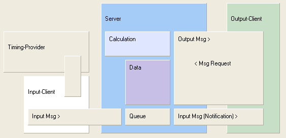
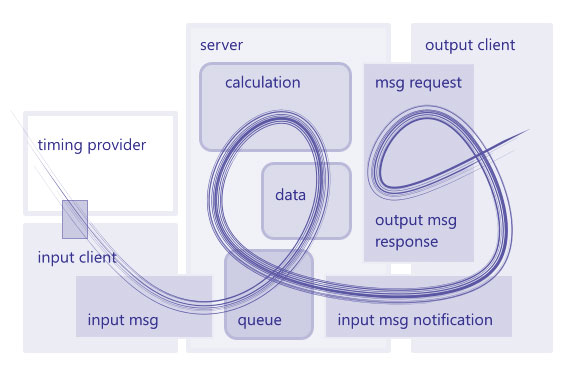
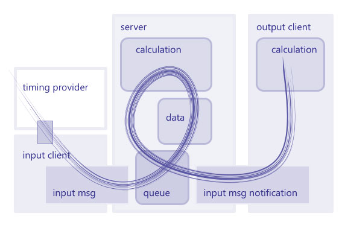

# Nachrichtenfluss

Das Bild zeigt den Nachrichtenfluss im System. Der Server (hellblau) soll
zwei Server-Sockets haben (einer links und einer rechts). Inputclient und
Output client haben jeweils einen Clientsocket und verbinden sich manuell mit dem
Server.

*Nachrichtenfluss-Bild, erstellt mit Delphi Form Designer* 

Nachfolgend beschrieben ist ein typisches Szenario, welches mit einer
einzeiligen Nachricht beginnt (es geht links oben los):

1. Der Timing-Provider (Sensor) sendet in seinem eigenen Format, diese
Nachrichten müssen umgesetzt werden. Dazu wird normalerweise ein extra externer
Adapter eingefügt.
1. Der Server empfängt einzeilige Nachrichten vom Inputclient. Diese
Nachrichten liegen im vom System vorgegebenen Format vor.
1. Der Server prüft die Nachrichten, ignoriert ungültige.
1. Der Inhalt der gültigen Nachrichten wird übernommen (Data), die Messages
werden zur Queue hinzugefügt. Der Cache (für Reports, optional, nicht
gezeichnet) wird als ungültig markiert.
1. Der Server kann jetzt noch weitere, anstehende Nachrichten auswerten.
1. Wenn der Server damit fertig ist (Idle-Processing) geht es weiter. Es wird
zunächst neu berechnet (wenn erforderlich), dann wird die Queue bearbeitet.
1. Die Verarbeitung der Queue bedeutet, dass die darin gesammelten einzeiligen
Nachrichten ausgangsseitig an alle verbundenen Clienten gesendet werden
(Multicast). Output-Clienten erhalten also genau die gleichen Nachrichten wie der
Server selbst.
1. Oft wird ein Output-Client die kurzen Nachrichten gar nicht vollständig
auswerten. Er vermutet einfach, dass sich was geändert hat und fordert sich die
aktuelle Version des Reports an, den er gerade darstellt. (MsgRequest)
1. Der Server beantwortet diese Anfrage, indem er den Report frisch generiert
und zurücksendet. Der Report wird außerdem im Cache gepuffert.
1. Zukünftige Anfragen für genau diesen Report werden eventuell nicht neu
berechnet sondern direkt aus dem Cache genommen.

*kompletter traditioneller Nachrichten-Fluss* 

Da die eingangsseitig empfangenen einzeiligen Nachrichten unverändert
weitergesendet werden an potentiell mehrere angeschlossene Clienten kann mit
Hilfe von Serverkoppler-Bausteinen eine baumartige/kaskadenartige Vernetzung von
(identischen) Servern erfolgen. (Der Serverkoppler hat zwei Client-Sockets und
sendet alles am Ausgang weiter was er am Eingang empfängt.) Es ist darauf zu
achten, dass man keine Rückkopplung herstellt, zum Beispiel durch Verbinden mit
dem falschen Socket.

Zum Verbinden zweier Server wird aber in der Regel ein Switch oder eine
Bridge benutzt.

Ein Switch verwendet dabei direkt die sowieso vorhanden Server-Sockets
(Eingang und Ausgang). Eine Switch Implementierung liegt als Delphi Anwendung vor
(auch als Windows Service).

Dagegen gibt es eine ganze Hierarchie von Implementierungen des
Bridgekonzeptes. Die Serveranwendung verwendet dabei immer einen Clientsocket
(tcp oder http oder intern) um die Verbindung mit der Bridge herzustellen.

Am Servereingangssocket können auch mehrzeilige Telegramme empfangen werden,
diese werden nicht weitergesendet. Eine Liste von Eingangsnachrichten bildet zum
Beispiel eine mehrzeilige Message.

Einer Nachricht am Eingang kann auch ein Request (oder mehrere) vorangestellt
werden. Damit wird ein Request/Response Muster auch am Eingang möglich. Nur am
Eingang können jedoch Eingangsdaten empfangen werden.

Ein Request am Eingang muss immer in Form einer mehrzeiligen Message gesendet
werden, sonst ist er ungültig (minimal Leerzeile als zweite Zeile ist ok). Eine
Nachricht am Eingang, die einen Request enthält, wird also niemals
weitergesendet (nur einzeilige Nachrichten entsprechend dem
Eingangsdatenprotokoll werden weitergesendet). Mehrzeilige Nachrichten am
Eingang werden sofort bearbeitet, landen auch nicht in der Queue.

Nachrichten am Eingang, die vom Switch kommen (oder Bridge), werden ebenfalls
nicht weitergesendet.

Benutzereingaben in einer eventuell vorhandenen grafischen Oberfläche der
Serveranwendung (Grid) werden teilweise in Nachrichten umgesetzt, die dann am
Ausgang versendet werden. Diese Nachrichten unterscheiden sich in keiner Weise
von den am Eingang empfangenen einzeiligen Nachrichten. Der Server kann damit
auch ohne externe Datenquelle betrieben werden

Damit sind die wesentlichen Elemente des Nachrichtenflusses skizziert. Alles
weitere sind Details.

## Optimaler Fluss

Wenn der Output Client keinen Request stellen muss,
weil er aktuell ist und den neuen Status berechnen kann wenn er eine einzeilige Nachricht empfängt,
dann sieht das Bild so aus:

*picture of streamlined message flow* 

In dieser Situation fließen pro Nachricht nur wenige Byte durch das System.

Weiter zum [Nachrichtenplan](doc-msg-map.html).