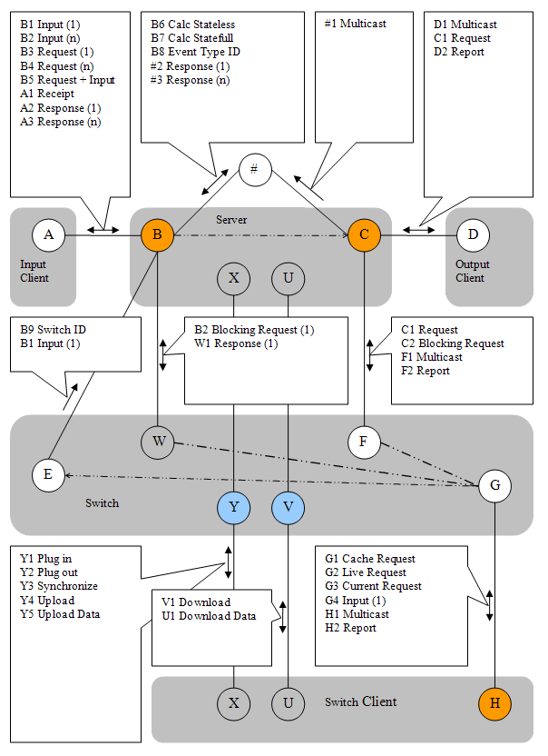

# Nachrichtenplan

## Das Bild zum Nachrichtenplan

Die obere Zeile im Bild ist die Hauptachse des Nachrichtenverkehrs zwischen Inputclient, Serveranwendung und Output-Client.

Ebenfalls dargestellt/angedeutet sind interne Verbindungen (gekennzeichnet mit #).

Die Punkte B und C sind abstrakte Verbindungs-Punkte. Real existieren externe und interne Verbindungspunkte.
Es gibt einen Softwareschalter zwischen den internen und externen Punkten (Operation Connect/Disconnect).
Im Zustand Disconnected ignoriert der Server den externen Nachrichtenverkehr.

Unterhalb der Hauptachse ist die Switch Anwendung dargestellt. 
Mit Hilfe der Switch Anwendung können Serverdaten synchronisiert sowie Switch Clienten indirekt angeschlossen werden.

Ähnlich wie mit dem Switch können zwei Server über eine Bridge synchronisiert werden.
Bridgeverbindungen sind im Bild nicht dargestellt.
Wegen der Umkehr der Initiative beim Verbindungsaufbau sind beim Einsatz der Bridge in der Regel keine Firewall Einstellungen notwendig.
Silverlight Anwendungen werden zum Beispiel über eine Bridge angeschlossen.

Nachrichten können auch über eine eventuell im Server eingebettete Website gesendet werden. 
Dies betrifft sowohl Eingangsnachrichten (Ajax), die Anforderung von Reports und Steuerkommandos.

Die Anbindung von Bridge/Website erfolgt über die (internen) Verbindungspunkte B und C. 
Die externen Verbindungspunkte B, C und H sind in jedem Fall TCP-Server Sockets (Orange). 
Punkt V (Switch) ist ein Http-Verbindungspunkt.

##  Verbindung AB

- B1 im linken oberen Kasten bedeutet, dass eine Message von A nach B gesendet werden kann. 
- Der Buchstabe bezeichnet das Ziel. 
- Die Herkunft kann durch die Verbindungslinie eindeutig zugeordnet werden.
- Die Ziffer nach dem Buchstaben kennzeichnet die verschieden Fälle.
- **B1 Input (1)** - eine einzeilige Message kann vom Input zum Server gesendet werden. 
- **B2 Input (n)** - der Server kann mehrzeilige Messages vom Input empfangen.
- **B3 Request (1)** - die Message enthält einen einfachen Request./li>
- **B4 Request (n)** - die Message enthält einen mehrfachen Request (n-fach).
- **B5 Request + Input** - die Message enthält neben Input mindestens einen Request.
- **A1 Receipt** - steht für die optionale Quittung auf eine einzeilige Message.
- **A2 Response** - bezeichnet die Antwort auf einen einfachen Request (mit oder ohne Input) 
- **A3 Response (n)** - bezeichnet die zusammengesetzte Antwort (xml CDATA) auf einen mehrfachen Request am Input.

## Verbindung CD

- **D1 Multicast** - jede einzeilige Message vom Input wird an alle am Output angeschlossenen Systeme weitergesendet. 
Dies erfolgt nach Verarbeitung und Neuberechnung (unter Verwendung der internen MessageQueue). 
- **C1 Request** - ein Output Client fordert am Verbindungspunkt C (Server Output Socket) einen Report an,
der unverzüglich generiert und zurückgesendet wird.
- **D2 Report** - ein zuvor angeforderter Report erreicht den Client-Socket D der Output Anwendung. 

## Verbindung #B

- **B6 Calc Stateless** - Mehrzeilige Message, gesendet über 
interne Verbindung an Input B. Enthält die vollständigen Eventdaten, identisch 
mit einem Backup. Enthält weiterhin einen oder mehrere Requests für 
zurückzuliefernde Reports. Das primäre Anwendungsobjekt (BO) wird neu erzeugt 
und nach dem Methodenaufruf (Calc) wieder freigegeben. Es ist der typischer Fall 
bei einer Webanwendung. Es wird aber auch beim statuslosen 'Test/Calc-Server' 
verwendet. 
- **B7 Calc Statefull** - Mehrzeilige Message, gesendet über 
interne Verbindung an Input B. Enthält einen Request für den zurückzuliefernden 
Report. Das BO wird nicht neu erzeugt, der Status des BO wird beibehalten. 
- **B8 Event Type ID** - markiert eine interne Verbindung mit der 
Eventtyp-ID. Dies hat eine Bedeutung in einem Multieventtypserver, der über 
einen vorgeschalteten Messagerouter verfügt. Damit ist dieser in der Lage die 
Nachrichten über die richtige interne Verbindung weiterzuleiten, d. h. die 
Message zur Verarbeitung an das BO vom richtigen Typ zu senden. Jedes BO hat die 
Verbindungspunkte B und C. 
- **#2 Response (1)** - wie A2, nur über interne Verbindung 
- **#3 Response (n)** - wie A3, nur über interne Verbindung 

## Verbindung C#

- **#1 Multicast** - steht für ein Messagemulticast über interne Verbindungen. # kennzeichnet interne Verbindungen. 
Interne Verbindungen werden zum Beispiel aufgebaut, 
wenn in einer Serveranwendung Input- und/oder Output Clienten integriert wurden. 

## Verbindung XY

- **Y1 Plugin** - ein Switch Client fordert den Aufbau von (ein 
oder zwei) Verbindungen an. Dazu wird Verbindungspunkt Y verwendet, den der 
Switch bei Programmstart öffnet. Daraufhin wird der Switch die Verbindungen EB 
und/oder FC herstellen, wie angefordert, wenn es sich um einen Server handelt. 
Im Falle eines Switch Clienten wird stattdessen die Verbindung GH aufgebaut. Es 
sind in jedem Fall ganz normale Socket Verbindungen zum jeweiligen Partner. 
- **Y2 Plugout** - Umkehr von Plugin, der Switch schließt 
daraufhin die Verbindungen. Ein Switch Client sollte bei Programmende automatisch 
die Verbindung schließen. Normalerweise ist das Schließen eine manuelle Aktion 
(z.B. verfügbar über das Hauptmenü).
- **Y3 Synchronize** - Falls der Switch über einen eingebauten 
Cache verfügt können damit alle im Cache vorhandenen Reports als ungültig 
markiert werden (Age+1). Dies kann einen automatischen Aktualisierungsdurchlauf starten. 
- **Y4 Upload** - Ankündigung eines Uploads, unmittelbar 
nachfolgend wird Y5 gesendet. Im Switch wird ein Flag gesetzt, so dass die 
nachfolgende Message abweichend vom normalen Modus als Backup gespeichert wird. 
- **Y5 Upload Data** - Senden eines Backups zur Speicherung im Hauptspeicher der Switch Anwendung. 

<h2>Verbindung UV</h2>

- **V1 Download** - Anforderung eines Downloads. 
- **U1 Download Data** - die Antwort, also die Kombination aus gespeichertem Backup und Log. 
Das Log kann, je nach Event Typ, mit einer Merge-Funktion automatisch komprimiert werden, 
so dass sich nur das jeweils letzte Telegramm der jeweiligen Adresse im Log befindet. 

## Verbindung GH

- **G1 Cache Request** - der Switch Client fordert einen Report 
an, der aus dem im Switch eingebauten Cache stammen soll. 
- **G2 Live Request** - der Switch Client stellt eine Report Anforderung, 
die sofern möglich, an einen Server durchgestellt wird. 
Ein eventuell vorhandener Cache wird nicht benutzt. 
Wenn mehrere Server am Switch angeschlossen sind so wird der als Masterserver gekennzeichnete Server den Request erhalten. 
Falls kein Server als Masterserver gekennzeichnet ist wird automatisch mit einer einfachen Methode ein Server bestimmt. 
- **G3 Current Request** - die Anforderung verlangt, dass ein Report nur dann aus dem Cache gezogen wird, 
wenn der Report im Cache als aktuell gekennzeichnet ist. 
Sonst wird die Reportanfrage synchron von einem Server bearbeitet.

- **G4 Input (1)** - ein einzeiliger Input wird vom Switch Input Client an den Switch übergeben, 
der diesen über Punkt E an einen Server weiterleitet. 
Die Bestimmung des Servers erfolgt wie bei G2. 
- Die Message **F1** zum Switch wird an alle Switch Output Clienten weitergeleitet. 
Eine Switch Verbindung GH ist entweder als Input oder als Output gekennzeichnet. 
Nur die Outputs erhalten Multicastmessages. 
Ein am Switch angeschlossener Output Client verhält sich damit genauso wie ein am Punkt C angeschlossener normaler Output Client. 
Lediglich der Socket Typ (Client oder Server) sowie die Initiative beim Verbindungsaufbau dreht sich um. 
Switch Clienten sind nur mittelbar verbunden, können aber den Cache abfragen.
- **H1 Multicast** - die Multicastmessage erreicht einen Switch Output Clienten.
- **H2 Report** - ein angeforderter Report erreicht den Switch Clienten. 

## Verbindung WB

- **B2 Blocking Request (1)** - eine Anfrage G2 oder G3 kann vom Switch mit Hilfe eines blockierenden Requests B2 an einen Server gestellt werden. 
- **W1 Response (1)** - die Antwort auf B2. Da die Anforderung blockierend ist 
kann die Antwort leicht an den anfordernden Switch Output zurückgeliefert werden. 
Die Antwort wird in der Regel zusätzlich im Cache gespeichert. 
Normalerweise wird der Cache mit asynchronen Requests über Punkt E gefüllt. 

## Verbindung FC

- **C1 Request** - ein weitergeleiteter Request von Punkt G, siehe C2. 
- **C2 Blocking Request** - Es ist der Switch Implementierung überlassen, ob sie Anforderungen von Punkt G als C1- oder C2-Message implementiert. 
- **F1 Multicast** - einzeilige Message, die mit Multicast vom Server weitergesendet wird.
- **F2 Report** - die Antwort auf einen Request für die Auslieferung eines Reports. 
