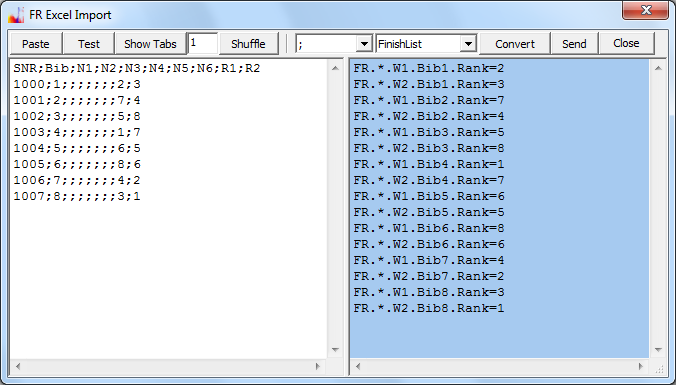

# Spreadsheet

## Aufgabenstellung

Angenommen Sie haben das Programm (FR Desktopanwendung) und die
Tabellenkalkulation (Excel) zur Verfügung. Sie möchten nun die Eingangsdaten im
Spreadsheet aufbereiten und dann in das Programm übernehmen.

Hier in diesem Artikel wird beschrieben, wie Sie tabellarische Daten für die
Startliste, die Definition der Flottenzugehörigkeit, die Namen der Athleten, die
Penaltyzuweisungen und natürlich die Zielpositionen übernehmen.

Die Übernahme der Zwischenzeiten für ein einzelnes Rennen wird nicht
beschrieben. Diese werden normalerweise online vom Timing Provider bereitgestellt
und es gibt bessere Möglichkeiten als die Übernahme vom Spreadsheet.

## Allgemeine Vorgehensweise

Das Programm kann tabellarische Daten über die Zwischenablage nicht nur
importieren sondern auch exportieren. Sie könnten also im Programm zuerst die
Parameter (Anzahl der Wettfahrten im Event) einstellen und die Event-Daten mit
Hilfe eines Menüpunktes in die Zwischenablage exportieren. Die in der
Zwischenablage abgelegten Daten können dann in ein Excel-Arbeitsblatt einfügt
werden. Damit haben Sie eine Vorlage zum Ausfüllen. Alternativ dazu könnten Sie
sich eine Beispiel-Excel-Datei herunterladen und diese als Ausgangspunkt
verwenden.

Aber auch ohne Vorlage ist es ganz einfach, Sie müssen nur wissen worauf es ankommt:

1. Konvention über Konfiguration: Die Benennung im Kopf der Spalten muss genau
so sein, wie das Programm es erwartet. Damit wird die Zuordnung der Spalten
realisiert. Das Umbenennen der Spalten ist in Excel schnell gemacht und kann im
Import-Dialog noch schnell korrigiert werden.
1. Konvention über Konfiguration: Die Reihenfolge der Spalten ist nicht
beliebig. Bei der Übernahme der Daten werden einzeilige Nachrichten generiert,
die den Wert einer Zelle darstellen. Diese Telegramme sendet das Programm später
über eine interne Verbindung an sich selbst. Der Vorgang des Datenimports
beinhaltet also die Generation der Nachrichten. Damit diese Aufgabe nicht
unnötig komplex wird, müssen die Informationen, die für die Zuordnung der Daten
benötigt werden, am Anfang stehen, so dass die Telegramme ohne zweiten Durchlauf
sofort erzeugt werden können. Beispiel: Die Schlüsselfelder SNR oder Bib müssen
vor den Wertfeldern RX für die Zielpositionen stehen.
1. Die Werte in den Zellen müssen für das Programm verständlich sein. Bei den
Zielpositionen ist es einfach, es sind ganze Zahlen. Bei den Namen ist es im
Prinzip auch einfach, diese werden unverändert übernommen. (Das aktuelle
Programm unterstützt Unicode.) Nur bei den Penaltywerten müssen Sie genau
wissen, wie diese zu formatieren sind. Hier folgt das Programm einer Konvention,
die durch Open Source Software etabliert wurde.

## Details

### Penaltywert Formatierung

Die FR Programme können potentiell verschiedene Auswertemodule benutzen. Das
Auswertemodul (Scoring Engine) kann ausgetauscht werden. Es ist beabsichtigt,
ein Auswertemodul als Open Source Projekt zur Verfügung zu stellen, damit es
unabhängig kontrolliert, verbessert und aktualisiert werden kann.

Die Planung bezüglich der [Liste der möglichen Penaltyzuweisungen](doc-supported-penalties.html) muss
auf das verwendete Scoring Modul abgestimmt werden,
bzw. auf das jeweils gültige Regelwerk.
Der Umfang der gespeicherten Information muss den Anforderungen der potentiell verwendungsfähigen Auswertemodule gerecht werden.

Als Minimum werden die Angaben dns, dnf und dsq unterstützt. Darüber hinaus
ist die Formatierung der Penaltywerte weitgehend kompatibel zu JavaScore. Bitte
orientieren Sie sich an den Praxisbeispielen, die im Xml-Format und Text-Format
zur Verfügung stehen.

### Flottenzugehörigkeit

FR unterstützt alle Anforderungen, die für ein offizielles FleetRace in den
olympischen Klassen gestellt werden. Darin enthalten ist das Segeln in Gruppen
(Fleet) inklusive MedalRace. Was das Programm aber wegen veränderlicher
Spezifikation planmäßig nicht macht, ist die Berechnung der Flottenzugehörigkeit
selbst.

Gruppenzugehörigkeit wird im Programm immer durch eine Ganzzahl festgelegt.
Und zwar für jede Zelle im Event-Grid. Die Teilnehmer des MedalRace haben die
Flotte 0. Alle anderen Flotten haben aufsteigende Nummern, von 1 beginnend. Die
Matrix der Flottenzugehörigkeit kann als Tabelle importiert werden. Dies ist
immer eine extra Tabelle, wobei die Spaltenköpfe exakt die gleichen sind wie bei
der Matrix der Zielpositionen.

Bei der Verwendung von Flotten sollten Daten in mehreren Schritten
importieren werden, zuerst die Startliste, dann die Definition der
Flottenzugehörigkeit, dann die Zielpositionen und Penaltywerte. Auf jeden Fall
sollten Sie die Flotten zuweisen, bevor Sie in den [Eingabemodus Strict](doc-input-mode.html) schalten.
Die [Namen der Athleten](doc-entry-names.html) können unabhängig davon zu jeder Zeit importiert werden.

Der Vorteil einer Was-Wäre-Wenn-Analyse geht bei einem Gruppen-Rennen
leider teilweise verloren, da es dann keinen Sinn macht, Änderungen an einer
schon abgelaufenen Gruppenphase vorzunehmen. Egal, FR unterstützt Flotten.
Um die manuelle Eingabe in FR zu vermeiden, können die Gruppen über die
Zwischenablage von Excel importiert werden, für eine oder mehrere
Wettfahrten.

Aus meiner Sicht macht es Sinn, die Daten von Excel direkt in die Text-Datei
des Wettkampfes einzufügen, welche anschließend von FR geladen wird. Sollten Sie
die Flottenzugehörigkeit nur kopieren wollen, von einem Race zum nächsten, dann
kann das direkt über einen Menüpunkt in der grafischen Oberfläche des Programms
vorgenommen werden. Die Flottenzugehörigkeit kann interaktiv auch einzeln für
jede Zelle im Grid eingestellt werden, und wird durch farbige Hinterlegung der
Zelle gekennzeichnet, wenn der **Color F** Farbmodus aktiv ist.

### Dialog

Nachdem ich die Penalties und die Flotten kurz abgehandelt habe, 
komme ich nun zum eigentlichen Thema. 
Zunächst ein Bild, die Erläuterung folgt.

So benutzen Sie den Import Dialog:

1. Selektieren und kopieren Sie die Tabelle in Excel einschließlich der Spaltenköpfe.
1. Fügen Sie die Daten mit Paste oder Control V in das weiße Memo ein.
1. Alternativ können Sie mit Button **Test** Testdaten einfügen, um zu testen.
1. Drücken Sie den Button **Show Tabs**, wenn die Daten von Excel aus mit Tabulator getrennt wurden,
das ist normalerweise der Fall.
Es werden dann einfach die Tabulatoren durch ein Semikolon ausgetauscht, damit Sie keine unsichtbaren Zeichen mehr haben.
1. Mit dem Button **Shuffle** kann die Zeilenzahl reduziert werden.
Geben Sie eine 2 in das Editierfeld links vom Button ein, um die Zeilenzahl zu halbieren.
Sie haben dann weniger Zeilen, die länger sind.
Das kann eventuell die einfachste Lösung sein, wenn die Daten im Spreadsheet in einem mehrzeiligen Layout vorliegen.
1. Sie können die Daten im linken Memo editieren, zum Beispiel die Spaltenüberschriften korrigieren.
1. Selektieren Sie das Zeichen, mit dem die Felder getrennt sind, hier Semikolon, in der **Combobox**.
1. Wählen Sie, was Sie importieren wollen, hier nur die **FinishList**.
1. Drücken Sie den Button **Convert** um die Liste der einzeiligen Telegramme zu generieren.
1. Jetzt können Sie die Telegramme im blauen Memo noch bearbeiten, z.B. Zeilen löschen.
1. Mit dem Button **Send** würden Sie die Telegramme zur Verarbeitung an das Programm schicken.
1. Mit dem Button **Close** schließen Sie den Dialog, egal ob Sie die Telegramme im blauen Memo gesendet haben oder nicht.
1. Wenn Sie den Dialog erneut öffnen, sind die Daten noch da,
Sie könnten also nochmal das gleiche senden, was beim Testen hilfreich sein kann.

Durch die beiden editierbaren Memofelder und die textbasierte, nachrichtenorientierte Funktionsweise wird der Import flexibel. 
Im Prinzip können Sie vorbereitete Telegramme (zum Beispiel die Tabelle der Stammdaten)
auch in das blaue Memo einfügen und mit dem **Send** Button über die interne Verbindung an das Programm zur Verarbeitung übergeben. 
Oder Sie senden die Nachrichten über das Netzwerk mit Hilfe eines der Programme im System FR. 
Oder Sie fügen die Telegramme in die Text-Datei auf der Festplatte ein. 
Der Effekt ist immer gleich. 
Das Programm benutzt den gleichen, robusten Parser zur Auswertung des Inputs. 
Mehr über die Definition der Telegramme können Sie im Artikel [Nachrichtenbeispiel](doc-msg-example.html) lesen.

## Zusammenfassung

Durch die Umsetzung der tabellarischen Daten in einzelne Nachrichten kann der Import von Daten flexibel und robust realisiert werden. 
RiggVar Software stellt als Firma Lösungen zur Datenübertragung bereit und kümmert sich um die Netzwerkfähigkeit der Programme.

Die berechneten Felder können nicht importiert werden. 
Diese werden von derScoring-Engine berechnet. 
Die konkrete Implementierung der Scoring-Engine ist nicht Hauptgegenstand des Angebotes 
und eine Variante wird bei Bedarf austauschbar als Open Source Komponente zur Verfügung gestellt. 
Die Implementierung der Scoring-Engine hat eventuell Rückwirkungen auf die Definition und Formatierung der Penaltywerte im Hostprogramm. 
Die im Artikel gezeigte, prinzipielle Arbeitsweise des Imports der Daten vom Spreadsheet bleibt davon unberührt.

[Zurück](doc-index.html) zu den Dokumenten.