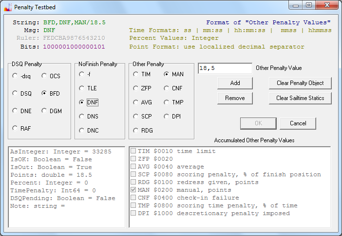

# Unterstützte Penalties

Das nachfolgende Bild vermittelt einen Überblick über die vom Programm FR unterstützen Penalty Zuweisungen.

Die Liste der möglichen Zuweisungen und deren Formatierung wurde weitgehend 
kompatibel nach dem Vorbild des Open Source Projektes JavaScore gestaltet. 
Dadurch ist es dem Hostprogramm möglich, eine Xml-Datei mit Eingangsdaten zu 
schreiben, die von JavaScore gelesen werden kann.

Sie können also im Prinzip das System [FR](../applications/FR) benutzen,
um die Daten vom Timing Provider einzusammeln,
und anschließend die Berechnung der Ergebnisse mit JavaScore durchführen.

Mit dem Dialog können Sie testweise beliebige Kombinationen von Penalty-Zuweisungen 
für einen Teilnehmer in einer Wettfahrt zusammenstellen und oben links den formatierten Wert ablesen.
Dieser Wert müsste dann rechts vom Gleichheitszeichen in einer [Nachricht](doc-msg-example) zur Penalty-Zuweisung erscheinen.

Die gleiche Formatierung verwenden Sie auch bei der direkten Eingabe in eine 
Zelle der Tabelle auf Seite Event im Programm. Um alle Penalty-Zuweisungen für 
eine Zelle zu löschen geben Sie ok ein. Mit einem vorangestellten Minus kann ein 
DSQ Penalty und ein sogenanntes NoFinish Penalty gelöscht werden, ohne 
gleichzeitig die Zuweisung einer Punkt-, Zeit- oder Prozentstrafe zu entfernen. 
Kombinierte Penalties sind in der Praxis eher selten vorzufinden. Deswegen 
müssen Sie sich eigentlich nur OK merken, und können dann den jeweiligen Wert 
neu eingeben. Bei der Eingabe von manuell festgelegten Strafpunkten ist der Wert 
mit Schrägstrich abzusetzen. Kleinbuchstaben werden auch akzeptiert.

Die Formatierungskonvention gilt ebenfalls für den Import von Daten aus dem [Spreadsheet](doc-spreadsheet-use).

Wenn Sie eine Text-Datei bearbeiten, dann sind Dezimalstellen immer mit Punkt 
(international) einzugeben. Bei der Eingabe in der grafischen Oberfläche (Grid) 
kann auf einer deutschen Tastatur auch ganz normal das Komma verwendet werden.

Welche Penalty-Kombinationen sinnvoll und/oder gültig sind wird durch das 
Regelwerk und die austauschbare Scoring-Engine bestimmt und ist nicht Gegenstand 
dieser Seite.

Abschließend noch eine Bemerkung zum Gültigkeitsbereich. Die hier 
beschriebenen Penalties gelten für die Auswertung des Events (Series-Scoring). 
Der Event-Teil des Programms ist damit sportartspezifisch. Der Race-Teil des 
Programms ist grundsätzlich sportartagnostisch und verwendet nur drei generische 
Penalty-Werte: dns, dnf und dsq. Die speziellen Penalty-Werte müssen also immer 
im Event-Teil eingegeben werden. Sie können im Race-Teil ein dnf oder dns schon 
mal eintragen. Diese Werte werden dann in den Event-Teil übernommen, so dass das 
Komitee nur noch die speziellen Fälle im Event-Tableau aktualisieren muss. Dies 
könnte vom Protestverhandlungsraum aus online mit einer Message erfolgen, die 
nach einer Eingabe im Grid mit Enter abgeschickt wird.
