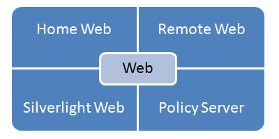



<h1>FRIA</h1>

<h2>Fleetrace Internet Anwendung</h2>

Für das Fleetrace Projekt (FR) wurden eine Reihe von
Internet Applikationen zur Verfügung gestellt (FRIA). Die
FRIA Applikationen sind als Silverlight Anwendungen ausgeführt.
Sie dienen zur Präsentation von Regattaergebnissen.

Die Silverlight Varianten von FleetRace lassen sich im Gegensatz
zu den Desktopanwendungen live im Browser demonstrieren. Es sind
zwei Demonstrationen online.

<h2>FRIA05</h2>

FRIA05 ist eine Applikation, die zur Anzeige von statischen Daten
dient. Die Daten werden dabei vom Server geladen. Der Server kann im
einfachsten Fall ein statischer Webserver sein, der xml-Dateien
ausliefert.

Die Silverlight Applikation wird zunächst eine Auflistung der
verfügbaren Daten laden. Wo die Daten liegen ist im
Initialisierungsparameter menuLocation angegeben, der die Position
von EventMenu.xml (kann anders benannt werden) festlegt. In
EventMenu.xml sind dann alle notwendigen Informationen enthalten, um
die einzelnen Events herunterzuladen. Nachdem die Xml-Datei für
einen Event vom Server geladen wurde hat FRIA05 ein Heimspiel. Die
Berechnung und Anzeige der Daten im Grid wird von FRIA05 selbst
erledigt.

<h2>FRIA01 bis FRIA11</h2>

Die anderen Varianten von FRIA zeigen weitere Daten an, sie sind
der Desktopanwendung noch ähnlicher. Einige Varianten können sich
über das Netzwerk live mit der Desktopanwendung verbinden und Daten
senden (dynamischer Silverlight Client).

<h2>FR04</h2>

Das Gegenstück zum dynamischen Silverlight Client ist die FR
Server Anwendung FR04. FR04 enthält ein Web Interface.

- Das Silverlight Web liefert den Silverlight Client aus.
- Der Policy Server ermöglicht dem Silverlight Client eine Verbindung zum FR Server.
- Mit dem Remote Web kann der Server kontrolliert werden.
- Über das Home Web können Daten angezeigt werden, die der Silverlight Client zum Server sendet.

<h2>Design</h2>

Bei den Silverlight Applikationen kommt es auf das Aussehen an.
RiggVar Software beabsichtigt in Zukunft mit einem Designer zusammenzuarbeiten, 
um für konkrete Einsatzfälle die individuelle Note zu realisieren. 
Die individuelle Note könnte neben dem Logo eines Vereins auch die Sponsorenlogos enthalten.

Die RiggVar FleetRace Internet Applikationen werden einzeln für jede Site lizensiert, 
auf der sie zum Einsatz kommen. 
Dabei wird das jeweilige Design eingesetzt und neu kompiliert.

Auch wenn mit dem Standardlook begonnen wird, um zunächst den
technischen Aspekt zu testen, ein späteres Austauschen des Designs
ist fest eingeplant.

**Update 2019**: Again, this is phantasy by the original developer.
And history may repeat itself, now with the Angular SPA applications.

Obwohl, ich muss darauf hinweisen, dass die Angular Material Design Komponenten gut aussehen.
