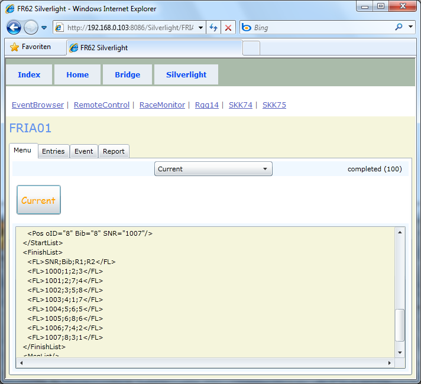



# FRIA01

*first* 

Index, Home, Bridge und Silverlight sind ganz normale Tabs auf einer normalen Webseite.
Ignorieren Sie die Farben. Das Design, von den Farben abgesehen, ist das normale template,
das damals mit Visual Studio geliefert wurde, perfekt für IE.

Der Silverlight Tab ist gerade ausgewählt.
Dort ist das eingebettete Objekt zu sehen, die Silverlight SPA Anwendung, gelb unterlegt.

Die Links (Anker Elemente) oberhalb von FRIA01 sind normale html Links auf der Seite.
Damit können folgende Silverlight Controls aufgerufen werden:

- EventBrowser
- RemoteControl
- RaceMonitor
- Rgg14 //RG Demo
- SKK74 //Schnitt Kreis Kreis Beispiel
- SKK75

Ich glaube FRIA01 ist der EventBrowser, im Umfang entsprechend FR01.

Im Bild zu sehen: Seite Menu.