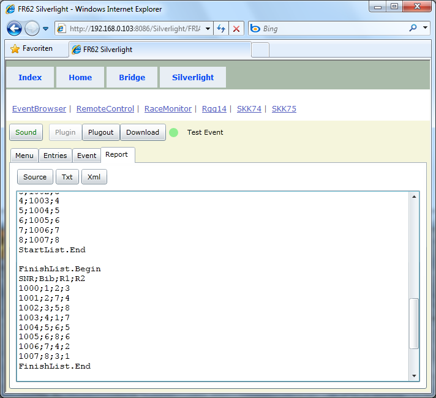



# FRIA02

Das müsste Remote Control sein, ein Silverlight Control welches, anstatt den eignen Namen oben einzublenden,
den Toolbar zeigt, mit dem die Verbindung zur Bridge hergestellt werden kann.

Der Toolbar ist ein Custom Control.

Diesmal m Bild zu sehen: Seite Report.
Die einzelnen Seiten sind immer die gleichen.

Außerdem zu sehen: Es wurde Plugin erfolgreich ausgeführt, wir sind verbunden, die LED ist grün.
Als nächstes könnte man die Verbindung schließen mit Plugout, oder die aktuelle Version der Event Daten herunterladen.
Test Event ist der Name des aktuellen Events.

Seite Menu fehlt: Diese Variante ist mit der ASP.NET Website verbunden, oder mit der Delphi Applikation.
Dort gibt es einen aktuellen Event, genau einen. Wir brauchen kein Event Menu.

Aktuell sind wir nicht verbunden, die LED ist Rot, die Aktion Plugin ist enabled.
Da wir nicht verbunden sind können wir uns auch nicht abmelden oder etwas downloaden.

Wahrscheinlich startet die Anwendung mit dem Standard Event, dem Test Event, der sollte Ihnen bekannt vorkommen.
Anstatt leer zu starten wird immer mit dem Test Event gestartet.