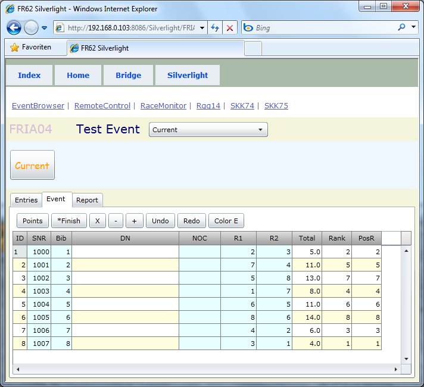



# FRIA04

*menu* 

Das Bild zeigt FRIA04, wenn es von der Desktopanwendung geladen wird.

Die FR Desktopanwendungen [FR04](../applications/FR04.html), [FR62](../applications/FR62.html) haben einen eingebetteten Server,
der neben dynamischen Html Seiten und Ajax Clienten auch Silverlight Clienten ausliefern kann.

Das Event Menü ist enthalten, nicht als Tab im Tab Control, aber oben drüber, die Feature Matrix stimmt.
Bridge Tab gibt es nicht.
