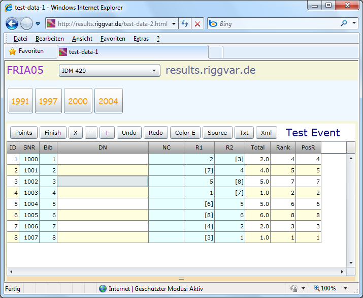



# FRIA05

*viewer* 

Das Bild zeigt FRIA05, das von der Website geladen wurde.

- FRIA05 kann von einer statischen Website ausgeliefert werden..
- Außer der .xap Datei für die Silverlight Anwendung selbst müssen Sie dazu nur die Xml-Dateien für die Events 
und ein Verzeichnis dieser Daten (EventMenu.xml) auf dem Server ablegen.
- Der Server kann auch ein Linux Webserver sein.
- Die Anwendung wurde mit Internet Explorer, Firefox und Safari getestet.

Da das Silverlight Control von der Website geladen wurde ist gibt es im Event Menü keine Combobox für die Url.
Die SPA Applikation kann sich nur mit der Site verbinden von der es geladen wurde (same site policy).
Die Combobox im Bild ist also die Kategorie-Combo.
Im Moment ausgewählt: Kategorie *IDM 420*. 
Sie legen fest, welche Kategorien es gibt, und welche Events sich auf Ihrem Server befinden.

FRIA05 ist noch eine alte Bezeichnung. Danach gab es die Bezeichnung FRIAS (S für Small, Small = Event Only).
Zur Zeit noch als Demo auf der Website befindet sich also FRIAS.xap, nicht FRIA05, aber das Bild in der Hilfe-Datei heißt halt FRIA05.

In der Feature Matrix ist *Report Tab* mit (x) angegeben.
Das stimmt im Prinzip, wie bei FRIA06 ist der Report Tab hier nicht als extra Tab sichtbar,
aber die Buttons **Source**, **Txt** und **Xml** sind auf Seite Event integriert,
und auch das Memo. Event Tab und Report Tab sind also hier verschmolzen.

Genau genommen sehe ich überhaupt keinen Tab, aber rein logisch sind die Funktionen vorhanden:
- vom Menu Tab,
- Event Tab und
- Report-Tab.

Entries Tab fehlt, 
es ist der Event Viewer, 
die Oberfläche für die Ansicht und Eingabe der Stammdaten-Tabelle kann hier entfallen.

> Sol langsam kriege ich es wieder zusammen. (18.05.2019)

Der Ersatz für FRIA05 bzw. FRIAS ist wahrscheinlich [FREO](../angular/FREO.html).
Wahrscheinlich, weil keiner weiß, was die User am Ende benutzen werden.
Ich könnte mir vorstellen, dass das Format für die Daten erhalten bleibt,
und eventuell noch mehr!

