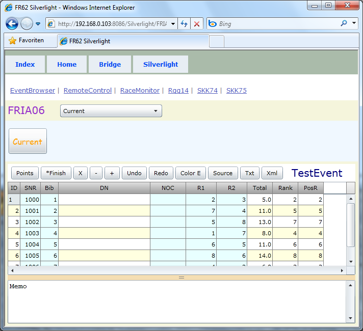



# FRIA06

*third* 

Keine Tabs, wie bei FRIA05.
Das Event Menu befindet sich oben.
Das Memo ist unten integriert.
Die übergeordneten Tabs für Index, Home, Bridge und Silverlight sind wieder da, bzw. noch, es ist Third.