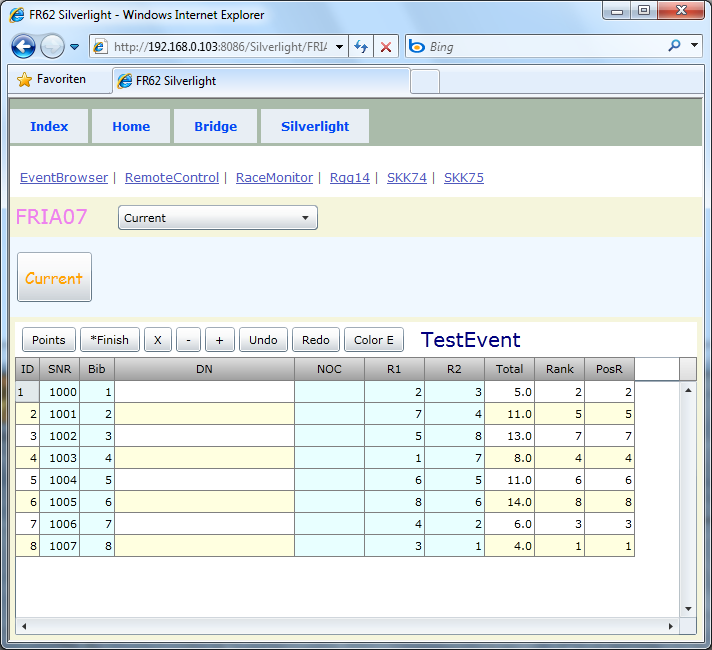



# FRIA07

*event* 

Laut Feature Matrix ohne MenuTab.
Was wir oben sehen ist aber der Current Event.

Laut Feature Matrix ohne Tab Report.
Im Vergleich zu FRIA06 ist hier auf Seite Event unten kein Memo mehr zu sehen,
und auch die Buttons Source, Text und Xml sind verschwunden.
Mit diesen Buttons konnte man die EventDaten im Memo ausgeben,
und über die Zwischenablage entnehmen.
