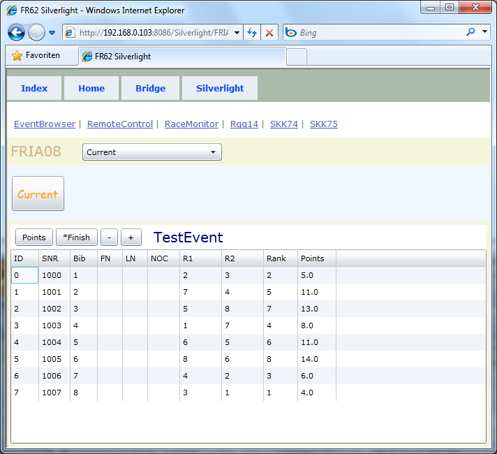



# FRIA08

*list* 

Es wird immer weiter abgerüstet, siehe Schaltflächen im Toolbar.

Außerdem wird hier das standardmäßigte DataGrid Control eingesetzt, es hat nicht die für FR üblichen Farben.
Das FR Grid heißt SilberGrid. Es wird überall sonst verwendet, hier nicht.
Dementsprechend kann der dafür erforderliche Quelltext auch entfernt werden.
