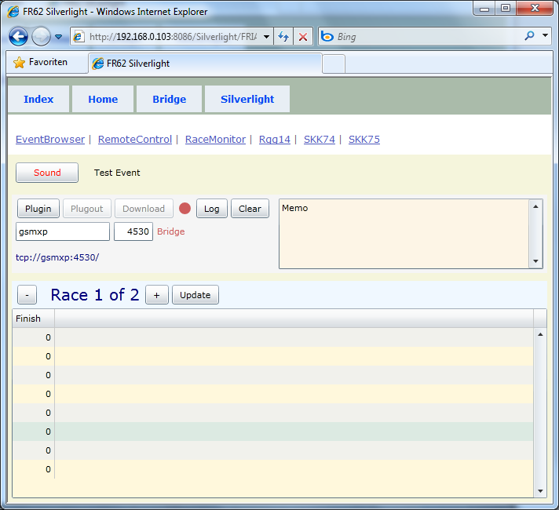



# FRIA10

*test* 

Laut Feature Matrix 2 Tabs, Mark und Bridge.

Man  kann sogar den Namen der Maschine direkt eingeben, mit der man sich verbinden will, wo der Server läuft.

Gsmxp muss eine tolle Maschine gewesen sein, mit Windows XP, immerhin.

4530 ist der Port für die Bridge, das kommt mir bekannt vor.
