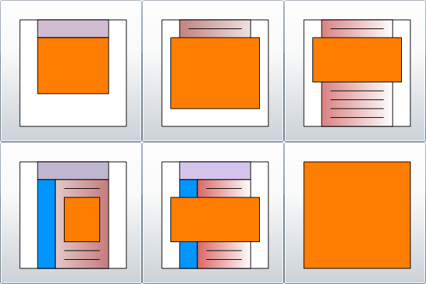



# FRIAS Layout

> Die Silverlight Technologie ist veraltet und wird (von Microsoft) nicht mehr unterstützt.

FRIAS ist ein Silverlight Control das mit unterschiedlicher Größe auf der Seite platziert werden kann.
Es können also verschiedene Layouts realisiert werden.
Der Benutzer muss das Layout wählen, dazu diente **DemoMenu.xap**, seinerseits ein Silverlight Control:

*Screenshot von DemoMenu.xap*<br>


Das Orangene Rechteck jeweils im Bild soll FRIAS sein, in der gewünschten Größe.

> Es können sich noch andere Elemente auf der Seite befinden.

## DemoMenu.xap

Es wurde so auf der Seite platziert.
```html
<div id="silverlightControlHost">
<object data="data:application/x-silverlight-2," 
  type="application/x-silverlight-2" width="600" height="400">
<param name="source" value="http://www.fleetrace.org/ClientBin/DemoMenu.xap" />
<param name="background" value="white" />
<param name="minRuntimeVersion" value="4.0.50401.0" />
<param name="autoUpgrade" value="true" />
```

Um das Control zu sehen müssen Sie Internet Explorer verwenden.
Mit IE 11 in Windows 10 sollte es funktionieren.

> Die alten Silverlight Projekte können in Visual Studio 2019 nicht mehr geöffnet werden.
> Aber mit VS Code kann ich noch im Source Code nachsehen..

Zurück zum Test von DemoMenu.xap mit Windows XP.
Das Control erscheint, aber wenn ich auf einen Button klicke, passiert nichts.
Zu erwarten wäre das eine andere Seite html aufgerufen wird mit **FRIAS.xap**, 
so eingestellt, das das gewünschte Layout realisiert wird.

> Hat aber früher funktioniert.

Die Gute Nachricht. Wenn ich die [FRIAS](FRIAS.html) Seite direkt aufrufe funktioniert es.

## Vollbild (Align Client)

Um FRIAS so groß wie möglich darzustellen im Browser-Fenster, und bei einem Resize auch so groß zu halten,
wurde css und javascript verwendet, wie folgt:

```html
<!DOCTYPE html PUBLIC "-//W3C//DTD XHTML 1.0 Transitional//EN" 
  "http://www.w3.org/TR/xhtml1/DTD/xhtml1-transitional.dtd">
<html xmlns="http://www.w3.org/1999/xhtml">

<head>
<meta content="text/html; charset=utf-8" http-equiv="Content-Type" />
<meta content="de" http-equiv="Content-Language"/>
<meta name="robots" content="noindex,nofollow"/>

<title>FRIAS-6</title>

<script src="javascripts/jquery-1.4.1.min.js" type="text/javascript"></script>

<style type="text/css">
   html, body {
     height:100%;
     width:100%;
     overflow:hidden;
   } 
   #silverlightControlHost {
     height:100%;
     width:100%;
     margin:-10px;
     position:absolute;
   }
</style>

<script type="text/javascript" id="SilverlightResizeScript">
$(pageReady);
function pageReady() {
$(window).resize(onWindowResize);
};
function onWindowResize() {
var b = $("body");
var d = $("#silverlightControlHost");
d.height(b.height() - d.offset().top);
d.width(b.width() - d.offset().left);
}
</script>

</head>
<body>

<div id="silverlightControlHost">
<object type="application/x-silverlight-2" width="100%" height="100%">
<param name="source" value="http://www.fleetrace.org/ClientBin/FRIAS.xap"/>
<param name="background" value="white" />
<param name="minRuntimeVersion" value="4.0.50401.0" />
<param name="autoUpgrade" value="true" />
<param name="initParams" value="at=5,dock=xy,menuLocation=http://www.fleetrace.org/DemoIndex.xml" />
<a href="http://go.microsoft.com/fwlink/?LinkID=149156&v=4.0.50401.0" style="text-decoration:none">
  
</a>
</object>
<iframe style="visibility:hidden;height:0;width:0;border:0px"></iframe></div>

</body>
</html>
```

Das wäre die Layout-Variante FRIAS-6, entsprechend dem Button auf Position 6, rechts unten im Bild.

> Es geht aber um die modernen Varianten.

Ja ja, ich beginne aber mit der Historie, 
das Syntax Highlighting mit Hilfe von Jekyll und Rouge ist doch nicht schlecht, oder?
Da lohnt sich doch die *Dokumentation* der Historie.

Übrigens, haben Sie den Parameter `menuLocation` entdeckt?
**DemoIndex.xml** ist hier nur ein anderer Name für **EventMenu.xml**, 
und das *Event Menu* sollte auch mit den Angular SPA Applikationen funktionieren,
und mit den Desktop Applikationen.