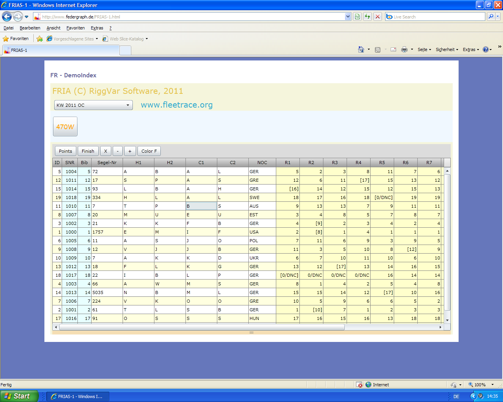



# FRIAS

Historisch, mehr sage ich dazu nicht.
Außer, dass S die kleine Größe ist, L wäre Large.
Large bedeutet: Der Race Teil ist drin und eine Verbindung zurück zur Desktop Applikation ist möglich.

Wenn Sie Windows benutzen und

- IE zur Verfügung haben und Silverlight installiert ist oder
- wenn Sie bereit sind Silverlight für IE 11 unter Windows 10 zu installieren

dann könnten Sie den folgenden externen link ausprobieren(over http):

[External link to FRIAS](http://federgraph.de/FRIAS-1.html){: .start-btn}  Nur vom **Internet Explorer** !

Wenn Sie das tatsächlich machen, dann sollten Sie im Control auch die Zielpositionen ändern,
direkt im Grid, mit der Tastatur vom Desktop, das geht auch heute noch nicht mit Angular.
Das andere, was Angular nicht kann: Eine normale Netzwerkverbindung aufzubauen über TCP zurück zur Anwendung.
Dafür würde man einen Node.js-Proxy benötigen. Oder die Anwendung unterstützt Web-Sockets.
Allerdings unterstützt die Delphi-Anwendung keine Web sockets, und man könnte argumentieren, 
dass sie das auch nicht unbedingt sollte. Mal sehen wie es weitergeht.

> Zuletzt getestet im Mai 2019.

Schnell vorwärts (fast forward) zu [Angular](../angular/FREO.html)