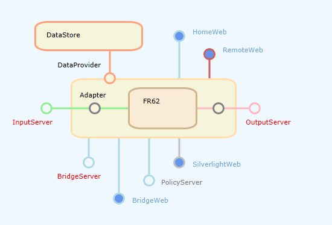

# FR Feature Graph

Feature Graph war/ist ein weiteres Silverlight Control,
welches in IE via http von FR69 geladen werden konnte.
Es liefert einen Überblick, welche Ports geöffnet sind.
Wenn man mit der Maus über die einzelnen Punkte fährt
wird die jeweilige Url eingeblendet (tcp oder http).
Die http-Verbindungspunkte sind links und können geklickt werden. 



Die graphische Darstellung visualisiert die Information,
die in folgendem Xml transportiert wird:

```xml
<?xml version="1.0" ?>
<FeatureMap Host="localhost">
<PortMap>
<Component CID="IS" Port="3427" IsConnected="True" />
<Component CID="OS" Port="3428" IsConnected="True" />
<Component CID="BS" Port="4530" IsConnected="True" />
<Component CID="HW" Port="8086" Path="home/" IsConnected="True" />
<Component CID="RW" Port="8086" Path="remote/" IsConnected="True" />
<Component CID="BW" Port="8086" Path="bridge/" IsConnected="True" />
<Component CID="SW" Port="8086" Path="silverlight/" IsConnected="True" />
</PortMap>
</FeatureMap>
```

Im *Silverlight Web* finden Sie einen link, mit dem das Xml direkt abgerufen werden kann. Das Silverlight Web selbst ist nur verfügbar,
wenn das Control im Ordner ClientBin vorhanden ist,
und das Web Interface freigegeben wurde.

Es ist also normalerweise in FR69 nicht verfügbar,
weil das Control FRFG01.xap nicht zu GitHub hochgeladen wurde.

> Silverlight ist als Technologie nicht mehr aktuell, das Control müsste ersetzt werden.