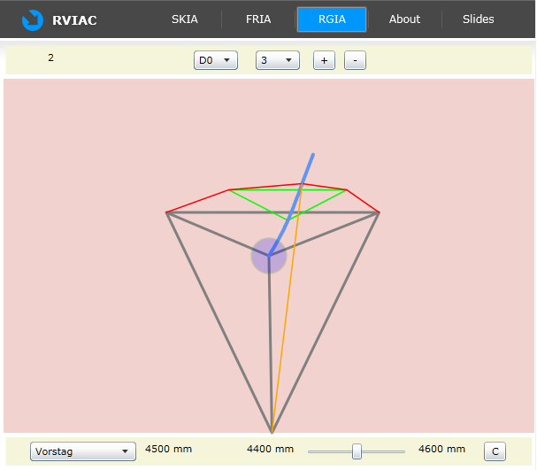
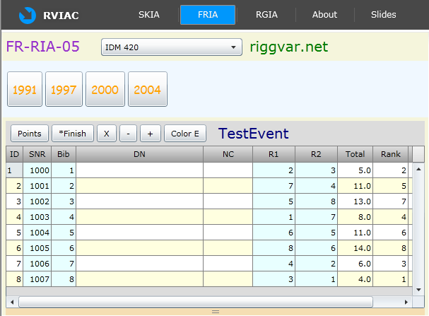



# RVIAC

RVIAC ist die *kombinierte* Silverlight Demoanwendung. Es ist technisch eine
sogenannte Silverlight Navigationsanwendung. Das bedeutet, dass es mehrere
Seiten/Tabs gibt, die der Benutzer anklicken kann. RVIAC enthält die folgenden Seiten:
- SKIA, demonstriert den elektronischen Zirkel in unterhaltsamer Weise
- FRIA, die Demo für das FleetRace Projekt
- RGIA, die Silverlight-Variante des Rigg-Applets
- About, Seite mit einem kurzen Hilfetext.
- Slides, eine Seite mit verschiedenen Vektorgrafiken zum Thema Rigg

* * *

Die Grafik auf Seite RGIA kann mit der Maus gedreht, verschoben und in der
Form verändert werden. Zum Drehen ziehen Sie die Maus über dem roten Hintergrund
(linke und rechte Maustaste). Zum Verschieben ziehen Sie die Maus im blauen
Kreis. Zum Verändern der Form verwenden Sie den Scrollbar. Alles andere können
Sie durch Probieren herausfinden.



<hr/>

Das Grid auf Seite FRIA zeigt die berechneten Resultate einer Regatta. Nach
Start der Anwendung sind Standarddaten geladen. Über das Menü (ComboBox und
Button-Leiste) können statische Xml-Daten nachgeladen werden.



```
FR = Fleetrace
RIA = Rich Internet Application
SPA = Single Page Application
FRIA05 ~ FRIAS (Alias)
riggvar.net = alte domain, nicht mehr existent
IDM 420 = Kategorie, immer noch da
1991, 1997, 2000, 2004 = sollte ergänzt werden, XML Event Data File
TestEvent = Standard, es wurde noch nicht auf 1991 geklickt.
*Finish = Finish Positions werden angezeigt, gerade ausgewählt, statt Points
```

Durch direkte Eingabe in die editierbaren Spalten RX können Zielpositionen
und Penaltyzuweisungen verändert werden. Die Anzahl der gestrichenen Wettfahrten
kann mit Plus und Minus verändert werden. Die einzelnen Spalten lassen sich mit
Mausklick auf den Spaltenkopf sortieren. Mit X wird eine Wettfahrt aus der
Wertung genommen (Eine Zelle in der Spalte für die Wettfahrt muss dazu
fokussiert sein.) Mit Points/Finish wird der Anzeigemodus umgeschaltet. Der
Colorbutton rotiert den Modus für die Hintergrundfarbe.

<hr/>

Die RVIAC Demo konnten Sie ausgehend von der Demo Startseite testen.

